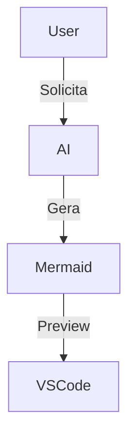

## Mermaid DO and DON'T

- **DON'T** use parentheses or special characters on graph titles or node labels
- **DO** be brief on graph boxes; brevity trumps precision
- **DON'T** rewrite a block if the flow points to an existing block; simply point to it
- **DO** name arrows with actions other than natural flow, preferindo verbos para indicar ação

# Infograph Prompt

**CRITICAL: You MUST write the diagram to the file. Do NOT just show it in chat.**

Follow these steps IN ORDER:

1. Analyze the current conversation and extract entities, relations, and topics
2. Generate a Mermaid diagram representing the structure, relations, or flow discussed
3. **USE replace_string_in_file or create_file tool** to write ONLY the Mermaid code block to `/Users/nfrota/Documents/nonlinear/internal/code/infograph.md`
   - No titles, no context, no extra text
   - ONLY the mermaid code block
4. **Open the file** using `run_in_terminal` with command: `code /Users/nfrota/Documents/nonlinear/internal/code/infograph.md`
5. Run the `markdown-preview-enhanced.openPreview` command to show the preview
6. Validate the diagram works in the preview

**Example file content (EXACTLY this format):**

**DO NOT respond with the diagram in chat. ONLY write it to the file, open it, and show preview.**
