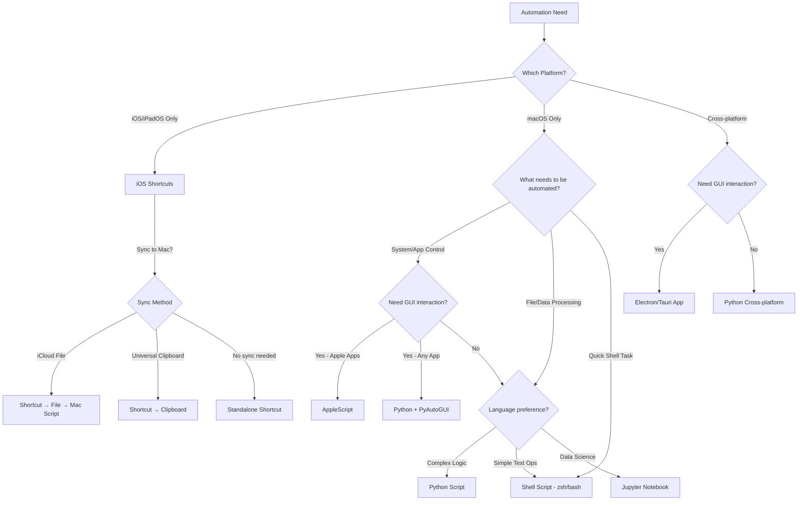

# Automation Tools - Decision Framework & Implementation Guide

## 🎯 Decision Tree: Which Tool to Use?



## 📊 Tool Comparison Matrix

| Tool                  | Platform       | GUI Control            | Data Processing | Learning Curve | Integration   | Best For                         |
| --------------------- | -------------- | ---------------------- | --------------- | -------------- | ------------- | -------------------------------- |
| **Shell (zsh/bash)**  | macOS/Linux    | Limited (AppleScript)  | Medium          | Low            | Excellent     | Quick file ops, git, build tasks |
| **Python**            | Cross-platform | Yes (PyAutoGUI)        | Excellent       | Medium         | Excellent     | Complex logic, data analysis     |
| **AppleScript**       | macOS only     | Excellent (Apple apps) | Limited         | Medium         | Good          | Automating Mac apps              |
| **iOS Shortcuts**     | iOS/iPadOS     | Excellent (iOS)        | Medium          | Low            | Good (iCloud) | Mobile automation, Safari        |
| **JavaScript (Node)** | Cross-platform | Yes (Puppeteer)        | Good            | Medium         | Excellent     | Web scraping, APIs               |
| **Jupyter Notebook**  | Cross-platform | No                     | Excellent       | Medium         | Good          | Data exploration, ML             |

---

## 1️⃣ Shell Scripts (zsh/bash)

### When to Use:

- ✅ File operations (move, copy, rename, find)
- ✅ Git automation
- ✅ Build/deploy tasks
- ✅ Quick text processing (grep, sed, awk)
- ✅ Chaining multiple CLI tools
- ❌ Complex data structures
- ❌ GUI automation

### Template:

```bash
#!/usr/bin/env zsh

# Description: What this script does
# Usage: ./script.sh [args]

set -euo pipefail  # Exit on error, undefined vars, pipe failures

# Constants
readonly SCRIPT_DIR="${0:A:h}"
readonly TIMESTAMP=$(date +"%Y-%m-%d_%H-%M-%S")

# Functions
main() {
    echo "Starting automation..."

    # Your logic here

    echo "✅ Done!"
}

# Run
main "$@"
```

### Location:

```
.github/scripts/your-script.sh
```

### Make executable:

```bash
chmod +x .github/scripts/your-script.sh
```

---

## 2️⃣ Python Scripts

### When to Use:

- ✅ Complex data processing
- ✅ API interactions
- ✅ File parsing (JSON, XML, CSV, HTML)
- ✅ Web scraping
- ✅ Cross-platform compatibility needed
- ✅ Need libraries (requests, pandas, etc)
- ❌ Simple file operations (use shell instead)

### Template:

```python
#!/usr/bin/env python3
"""
Description: What this script does
Usage: python3 script.py [args]
"""

import sys
from pathlib import Path
from datetime import datetime

# Constants
SCRIPT_DIR = Path(__file__).parent
TIMESTAMP = datetime.now().strftime("%Y-%m-%d_%H-%M-%S")

def main():
    """Main entry point."""
    print("Starting automation...")

    # Your logic here

    print("✅ Done!")

if __name__ == "__main__":
    main()
```

### Location:

```
.github/scripts/your-script.py
```

### Dependencies:

Create `requirements.txt`:

```
requests==2.31.0
beautifulsoup4==4.12.2
```

Install:

```bash
python3 -m pip install -r requirements.txt
```

---

## 3️⃣ AppleScript

### When to Use:

- ✅ Automating macOS apps (Finder, Safari, Mail, etc)
- ✅ GUI interactions on Mac
- ✅ System events (keyboard, mouse)
- ✅ Cross-app workflows
- ❌ Complex data processing
- ❌ Cross-platform needs

### Template:

```applescript
-- Description: What this script does
-- Usage: osascript script.applescript [args]

on run argv
    set timestamp to do shell script "date '+%Y-%m-%d %H:%M:%S'"

    display notification "Starting automation..." with title "Script Name"

    -- Your logic here
    tell application "Safari"
        -- Example: get URLs of all windows
        set allURLs to {}
        repeat with w in windows
            repeat with t in tabs of w
                set end of allURLs to URL of t
            end repeat
        end repeat
    end tell

    display notification "✅ Done!" with title "Script Name" sound name "Glass"

    return allURLs
end run
```

### Location:

```
.github/scripts/your-script.applescript
```

### Run:

```bash
osascript .github/scripts/your-script.applescript
```

---

## 4️⃣ iOS Shortcuts

### When to Use:

- ✅ Mobile automation (iPhone/iPad)
- ✅ Safari tab management
- ✅ Quick capture from iOS
- ✅ Siri integration
- ✅ Share sheet automation
- ❌ Complex logic
- ❌ Heavy data processing

### File Format:

Shortcuts are **binary plist files** (`.shortcut`)

### iCloud Sync Path:

```
/Users/nfrota/Library/Mobile Documents/iCloud~is~workflow~my~workflows/Documents/
```

### Creating Shortcuts: Methods

#### ⚠️ CRITICAL LIMITATION - iOS 15+ (2021+):

**Apple signs all `.shortcut` files** since iOS 15. Unsigned/modified files **CANNOT** be imported.

**What DOESN'T work:**

- ❌ Creating `.shortcut` files from scratch on Mac
- ❌ Editing existing `.shortcut` files externally then importing
- ❌ Using `python-shortcuts` library (archived, pre-iOS 15)
- ❌ Using `shortcuts-js` library (archived, iOS 12 era)
- ❌ Importing unsigned files via any method (Files app, AirDrop, etc)

**What WORKS:**

1. ✅ **Create placeholder on iOS** → **Edit on Mac** → **Sync back via iCloud** (EXPERIMENTAL)
2. ✅ **Manual creation** on iOS following step-by-step guide (SAFEST)
3. ✅ **URL Schemes** to trigger/run existing shortcuts (`shortcuts://run-shortcut?name=...`)
4. ✅ **iCloud sharing links** (generates signed URL, only from Shortcuts app)

**Community consensus (r/shortcuts, GitHub, RoutineHub):**

- Pre-iOS 15 (2021): Full programmatic creation worked perfectly
- iOS 15+: Apple locked down - **signing is MANDATORY**, no bypass exists
- **Best practice:** Create minimal shell on iOS, use URL schemes + chaining for automation

**Key Resources:**

- **python-shortcuts:** https://github.com/alexander-akhmetov/python-shortcuts (ARCHIVED - pre-iOS 15)
- **shortcuts-js:** https://github.com/joshfarrant/shortcuts-js (ARCHIVED - iOS 12 era)
- **iOS-Shortcuts-Reference:** https://github.com/sebj/iOS-Shortcuts-Reference (file format docs)
- **r/shortcuts:** https://reddit.com/r/shortcuts (very active community)
- **RoutineHub:** https://routinehub.co/ (community shortcuts library)

---

### URL Schemes - Automation Workaround

Since iOS 15+ blocks unsigned shortcuts, the community uses **URL Schemes** for automation:

**How it works:**

1. Create shortcuts manually on iOS (one-time setup)
2. Trigger them via URL from anywhere (Mac scripts, other shortcuts, web, etc)
3. Chain multiple shortcuts together via URL calls

**Common URL Schemes:**

```bash
# Run a shortcut
shortcuts://run-shortcut?name=My%20Shortcut

# Run with input
shortcuts://run-shortcut?name=Export%20Tabs&input=text

# Run with clipboard as input
shortcuts://run-shortcut?name=Process&input=clipboard

# Open shortcut for editing
shortcuts://open-shortcut?name=My%20Shortcut

# Create new shortcut
shortcuts://create-shortcut

# Import from URL (must be SIGNED iCloud link)
shortcuts://import-shortcut/?url=https://icloud.com/shortcuts/...&name=Name
```

**From Mac → iPhone automation:**

```bash
# Trigger shortcut on iPhone via SSH (if jailbroken)
ssh iphone "open 'shortcuts://run-shortcut?name=Export%20Safari%20Tabs'"

# Or via URL in email/message (manual click)
echo "shortcuts://run-shortcut?name=Export" | pbcopy

# Or via web server (iPhone opens URL)
python3 -m http.server 8000
# Visit on iPhone: http://mac-ip:8000 with redirect to shortcuts://
```

**Shortcut chaining pattern:**

```
Shortcut A (on iPhone):
1. Get Safari Tabs
2. Save to file
3. Open URL: shortcuts://run-shortcut?name=Shortcut%20B

Shortcut B:
1. Read file
2. Process data
3. Show notification
```

---

### Method 1: Create on iOS, Edit on Mac ✅ RECOMMENDED

**Step 1 - On iPhone/iPad:**

1. Create minimal placeholder shortcut:
   - Get Safari Web Pages
   - Text (any text)
   - Show Notification
2. Name it (e.g., "Safari Tabs Exporter")
3. Wait ~30s for iCloud sync

**Step 2 - On Mac:**

```bash
# Find the shortcut
ls -lat "/Users/nfrota/Library/Mobile Documents/iCloud~is~workflow~my~workflows/Documents/" | head -10

# Convert to XML for editing
plutil -convert xml1 -o /tmp/shortcut.xml "Path/To/Your.shortcut"

# Edit /tmp/shortcut.xml (see structure below)

# Convert back to binary
plutil -convert binary1 /tmp/shortcut.xml -o "Path/To/Your.shortcut"
```

**Step 3 - Back on iOS:**

- Wait ~30s for sync
- Open shortcut and test
- If it works, you successfully edited it! 🎉

---

### Shortcut File Structure (XML Format)

```xml
<?xml version="1.0" encoding="UTF-8"?>
<!DOCTYPE plist PUBLIC "-//Apple//DTD PLIST 1.0//EN" "http://www.apple.com/DTDs/PropertyList-1.0.dtd">
<plist version="1.0">
<dict>
    <!-- Required Keys -->
    <key>WFWorkflowClientVersion</key>
    <string>2605</string>

    <key>WFWorkflowClientRelease</key>
    <string>3.0</string>

    <key>WFWorkflowMinimumClientVersion</key>
    <integer>900</integer>

    <key>WFWorkflowMinimumClientVersionString</key>
    <string>900</string>

    <!-- Icon Configuration -->
    <key>WFWorkflowIcon</key>
    <dict>
        <key>WFWorkflowIconGlyphNumber</key>
        <integer>59735</integer>

        <key>WFWorkflowIconStartColor</key>
        <integer>4282601983</integer> <!-- Red, see color table below -->
    </dict>

    <!-- Input Types Accepted -->
    <key>WFWorkflowInputContentItemClasses</key>
    <array>
        <string>WFStringContentItem</string>
        <string>WFURLContentItem</string>
        <string>WFSafariWebPageContentItem</string>
    </array>

    <!-- Availability -->
    <key>WFWorkflowTypes</key>
    <array>
        <string>NCWidget</string>      <!-- Show in Widget -->
        <string>WatchKit</string>      <!-- Show on Apple Watch -->
        <string>ActionExtension</string> <!-- Show in Share Sheet -->
    </array>

    <!-- Import Questions (optional) -->
    <key>WFWorkflowImportQuestions</key>
    <array/>

    <!-- ACTIONS ARRAY -->
    <key>WFWorkflowActions</key>
    <array>
        <!-- Action 1: Get Safari Web Pages -->
        <dict>
            <key>WFWorkflowActionIdentifier</key>
            <string>is.workflow.actions.getwebpages</string>

            <key>WFWorkflowActionParameters</key>
            <dict>
                <key>UUID</key>
                <string>A1B2C3D4-E5F6-4789-A1B2-C3D4E5F67890</string>
            </dict>
        </dict>

        <!-- Action 2: Set Variable -->
        <dict>
            <key>WFWorkflowActionIdentifier</key>
            <string>is.workflow.actions.setvariable</string>

            <key>WFWorkflowActionParameters</key>
            <dict>
                <key>UUID</key>
                <string>B2C3D4E5-F6A7-4890-B2C3-D4E5F6A78901</string>

                <key>WFVariableName</key>
                <string>AllTabs</string>
            </dict>
        </dict>

        <!-- Action 3: Repeat with Each -->
        <dict>
            <key>WFWorkflowActionIdentifier</key>
            <string>is.workflow.actions.repeat.each</string>

            <key>WFWorkflowActionParameters</key>
            <dict>
                <key>UUID</key>
                <string>C3D4E5F6-A7B8-4901-C3D4-E5F6A7B89012</string>

                <key>WFInput</key>
                <dict>
                    <key>Value</key>
                    <dict>
                        <key>Type</key>
                        <string>Variable</string>
                        <key>VariableName</key>
                        <string>AllTabs</string>
                    </dict>
                    <key>WFSerializationType</key>
                    <string>WFTextTokenAttachment</string>
                </dict>
            </dict>
        </dict>

        <!-- End Repeat (ControlFlowMode=2) -->
        <dict>
            <key>WFWorkflowActionIdentifier</key>
            <string>is.workflow.actions.repeat.each</string>

            <key>WFWorkflowActionParameters</key>
            <dict>
                <key>UUID</key>
                <string>D4E5F6A7-B8C9-4012-D4E5-F6A7B8C90123</string>

                <key>WFControlFlowMode</key>
                <integer>2</integer> <!-- 2 = End Repeat -->
            </dict>
        </dict>

        <!-- Add more actions... -->
    </array>
</dict>
</plist>
```

### Common Action Identifiers:

**Safari & Web:**

```
is.workflow.actions.getwebpages              # Get Safari Web Pages
is.workflow.actions.closealltabswithsafari   # Close All Tabs with Safari
is.workflow.actions.properties.safariwebpage # Get Details of Safari Web Page
is.workflow.actions.url                      # URL
is.workflow.actions.openurl                  # Open URLs
is.workflow.actions.geturl                   # Get Contents of URL
```

**Variables & Logic:**

```
is.workflow.actions.setvariable              # Set Variable
is.workflow.actions.getvariable              # Get Variable
is.workflow.actions.appendvariable           # Add to Variable
is.workflow.actions.repeat.each              # Repeat with Each (WFControlFlowMode: 0=start, 2=end)
is.workflow.actions.repeat.count             # Repeat (count times)
is.workflow.actions.conditional              # If (WFControlFlowMode: 0=if, 1=else, 2=end)
```

**Text & Data:**

```
is.workflow.actions.gettext                  # Text
is.workflow.actions.text.combine             # Combine Text
is.workflow.actions.text.match               # Match Text (regex)
is.workflow.actions.text.replace             # Replace Text
is.workflow.actions.count                    # Count Items
```

**Files & Documents:**

```
is.workflow.actions.documentpicker.save      # Save File
is.workflow.actions.documentpicker.open      # Get File
is.workflow.actions.file.append              # Append to File
is.workflow.actions.file.delete              # Delete Files
is.workflow.actions.getfile                  # Get File from Folder
```

**System & Device:**

```
is.workflow.actions.getdevicedetails         # Get Device Details
is.workflow.actions.date                     # Current Date
is.workflow.actions.format.date              # Format Date
is.workflow.actions.notification             # Show Notification
is.workflow.actions.alert                    # Show Alert
is.workflow.actions.vibrate                  # Vibrate Device
```

**Notes & Reminders:**

```
is.workflow.actions.createnote               # Create Note
is.workflow.actions.addnewreminder           # Add New Reminder
is.workflow.actions.getnotes                 # Get Notes
```

**Clipboard:**

```
is.workflow.actions.setclipboard             # Copy to Clipboard
is.workflow.actions.getclipboard             # Get Clipboard
```

**Photos:**

```
is.workflow.actions.takephoto                # Take Photo
is.workflow.actions.selectphoto              # Select Photos
is.workflow.actions.filter.photos            # Find Photos
```

**More Actions (partial list):**

```
is.workflow.actions.runworkflow              # Run Shortcut
is.workflow.actions.runsshscript             # Run Script Over SSH
is.workflow.actions.getitemfromlist          # Get Item from List
is.workflow.actions.detect.dictionary        # Get Dictionary from Input
is.workflow.actions.properties.articles      # Get Details of Articles
```

### Icon Colors (WFWorkflowIconStartColor):

```
Red:         0xFF4351FF / 4282601983
Dark Orange: 0xFD6631FF / 4251333119
Orange:      0xFE9949FF / 4271458815
Yellow:      0xFEC418FF / 4274264319
Green:       0xFFD426FF / 4292093695
Teal:        0x19BD03FF / 431817727
Light Blue:  0x55DAE1FF / 1440408063
Blue:        0x1B9AF7FF / 463140863
Dark Blue:   0x3871DEFF / 946986751
Violet:      0x7B72E9FF / 2071128575
Purple:      0xDB49D8FF / 3679049983
Pink:        0xED4694FF / 3980825855
Taupe:       0xB4B2A9FF / 3031607807
Gray:        0xA9A9A9FF / 2846468607
Dark Gray:   0x000000FF / 255
```

### Integration Pattern:

```
iOS Shortcut → Save to iCloud → Mac reads file → Process data
```

Example:

```bash
# Monitor for new files
SHORTCUTS_DIR="/Users/nfrota/Library/Mobile Documents/iCloud~is~workflow~my~workflows/Documents"

# Read latest export
cat "$SHORTCUTS_DIR/safari-tabs-export.md"
```

---

## 5️⃣ JavaScript/Node.js

### When to Use:

- ✅ Web scraping (Puppeteer, Playwright)
- ✅ API interactions
- ✅ JSON processing
- ✅ Build tools integration
- ❌ System-level automation
- ❌ File operations (use shell)

### Template:

```javascript
#!/usr/bin/env node

/**
 * Description: What this script does
 * Usage: node script.js [args]
 */

const fs = require("fs").promises;
const path = require("path");

const SCRIPT_DIR = __dirname;
const TIMESTAMP = new Date().toISOString().replace(/[:.]/g, "-");

async function main() {
  console.log("Starting automation...");

  // Your logic here

  console.log("✅ Done!");
}

main().catch((err) => {
  console.error("Error:", err);
  process.exit(1);
});
```

---

## 🔗 Integration Patterns

### Pattern 1: iOS → Mac Pipeline

```
1. iOS Shortcut captures data
2. Saves to iCloud Drive (Shortcuts folder)
3. Mac script monitors folder
4. Processes file automatically
5. Updates project files
```

**Implementation:**

```bash
# Mac-side watcher
fswatch -0 "$SHORTCUTS_DIR" | while read -d "" file; do
    python3 .github/scripts/process-shortcut-export.py "$file"
done
```

### Pattern 2: VS Code Task Runner

```
1. Create shell/python script
2. Add to .vscode/tasks.json
3. Run via Command Palette or keybinding
```

**tasks.json:**

```json
{
  "label": "Export Safari Tabs",
  "type": "shell",
  "command": ".github/scripts/safari-export.sh",
  "group": "build"
}
```

### Pattern 3: Git Hook Automation

```
.git/hooks/pre-commit
.git/hooks/post-commit
.git/hooks/pre-push
```

Example pre-commit:

```bash
#!/usr/bin/env zsh
# Format code before commit
python3 .github/scripts/format-code.py
```

---

## 📚 Resources & References

### Official Documentation:

- **Shell:** `man zsh`, `man bash`
- **Python:** https://docs.python.org/3/
- **AppleScript:** https://developer.apple.com/library/archive/documentation/AppleScript/
- **Shortcuts (SiriKit):** https://developer.apple.com/documentation/sirikit
- **Shortcuts User Guide:** https://support.apple.com/guide/shortcuts/

### Shortcuts File Format Resources:

**GitHub Reference (ESSENTIAL):**

- **iOS-Shortcuts-Reference:** https://github.com/sebj/iOS-Shortcuts-Reference
  - Complete file format documentation
  - Action identifiers and parameters
  - Icon colors and configuration
  - **Note:** Archived but still accurate for structure

**Key Findings:**

- **.shortcut files** are binary plists (pre-iOS 15) or **signed** (iOS 15+)
- **Signed files cannot be edited** directly - must use create-on-iOS → edit-on-Mac method
- Extract with: `plutil -convert xml1 -o output.xml input.shortcut`
- Convert back: `plutil -convert binary1 input.xml -o output.shortcut`

**URL Schemes for Shortcuts:**

```
shortcuts://                                       # Open Shortcuts app
shortcuts://create-shortcut                        # Create new shortcut
shortcuts://open-shortcut?name=[name]              # Open specific shortcut
shortcuts://run-shortcut?name=[name]&input=[text]  # Run shortcut with input
shortcuts://import-shortcut/?url=[url]&name=[name] # Import from URL (signed only)
```

### Reverse Engineering Shortcuts:

```bash
# Extract existing shortcut to XML
plutil -convert xml1 -o shortcut.xml "My Shortcut.shortcut"

# Study the structure
less shortcut.xml

# Modify and convert back
plutil -convert binary1 shortcut.xml -o "Modified.shortcut"

# Note: On iOS 15+, files are signed. Edit method:
# 1. Create minimal shortcut on iOS
# 2. Extract to XML on Mac
# 3. Edit XML
# 4. Convert back
# 5. Wait for iCloud sync to iOS
```

### Community Resources:

- **Shortcuts Gallery:** Built into iOS Shortcuts app (curated by Apple)
- **RoutineHub:** https://routinehub.co/ (community shortcuts library)
- **r/shortcuts:** https://reddit.com/r/shortcuts (Reddit community - very active)
- **MacScripter:** https://macscripter.net/ (AppleScript forum)
- **iOS-Shortcuts-Reference (GitHub):** https://github.com/sebj/iOS-Shortcuts-Reference (file format docs)

### Debugging:

```bash
# Shell scripts
set -x  # Enable debug mode
bash -x script.sh  # Run with tracing

# Python
python3 -m pdb script.py  # Interactive debugger

# AppleScript
log "Debug message"  # View in Console.app

# Shortcuts
# Add "Show Notification" actions throughout
```

---

## 🎯 Decision Checklist

Before choosing a tool, ask:

1. **Platform?**
   - iOS-only → Shortcuts
   - Mac-only → Shell/Python/AppleScript
   - Cross-platform → Python/Node

2. **GUI needed?**
   - Yes (Mac apps) → AppleScript
   - Yes (any) → Python + PyAutoGUI
   - No → Shell/Python

3. **Complexity?**
   - Simple → Shell
   - Medium → Python
   - Complex → Python + libraries

4. **Data type?**
   - Text/files → Shell
   - JSON/API → Python/Node
   - Web scraping → Python/Node

5. **Integration?**
   - Git hooks → Shell
   - VS Code tasks → Shell/Python
   - iOS sync → Shortcuts + Python

6. **Reusability?**
   - One-off → Shell
   - Repeatable → Python (proper structure)
   - Shareable → Documented Python package

---

## 📝 Best Practices

### All Tools:

- ✅ Add description/docstring at top
- ✅ Include usage examples
- ✅ Error handling
- ✅ Notifications/logging
- ✅ Idempotent (safe to run multiple times)
- ✅ Add to version control

### File Organization:

```
.github/
  scripts/
    shell/
      backup.sh
      deploy.sh
    python/
      sync_data.py
      process_exports.py
    applescript/
      safari_export.applescript
    shortcuts/
      Safari Tabs Exporter.shortcut
      Reading List Export.shortcut
```

### Naming Convention:

- **Shell:** `kebab-case.sh`
- **Python:** `snake_case.py`
- **AppleScript:** `PascalCase.applescript`
- **Shortcuts:** `Title Case.shortcut`

---

## 🚀 Quick Start Examples

### Example 1: Export Safari Tabs (iOS → Mac)

**iOS Shortcut** (`Safari-Tabs-Export.shortcut`):

- Get Safari Web Pages
- Format as markdown
- Save to Shortcuts folder

**Mac Script** (`.github/scripts/process-safari-export.py`):

```python
import sys
from pathlib import Path

shortcuts_dir = Path.home() / "Library/Mobile Documents/iCloud~is~workflow~my~workflows/Documents"
export_file = shortcuts_dir / "safari-tabs-export.md"

if export_file.exists():
    content = export_file.read_text()
    # Process content
    print(f"Processed {len(content.splitlines())} links")
```

### Example 2: Automated Git Commit

**Shell** (`.github/scripts/commit.sh`):

```bash
#!/usr/bin/env zsh
set -euo pipefail

message="${1:-Update content}"

hugo build
git add docs/
git commit -m "$message"
git push
```

**VS Code Task**:

```json
{
  "label": "✅ Commit changes",
  "type": "shell",
  "command": ".github/scripts/commit.sh \"${input:commitMessage}\""
}
```

---

## 💡 Next Steps

When you need automation:

1. **Check this guide** to pick the right tool
2. **Copy the template** for that tool
3. **Implement** incrementally
4. **Test** with small datasets
5. **Add error handling**
6. **Document** usage
7. **Integrate** with workflow (tasks, git hooks, etc)
