# ⚠️ CRITICAL: No MCP, No Answer

If MCP (research.py) cannot be run, the ONLY valid response is to inform the user of the error and STOP.
Never attempt to answer, summarize, or speculate. Any answer not directly grounded in MCP output is misleading and strictly forbidden.
It is always better to say “error” and stop than to provide an ungrounded or unverified answer.
Do not attempt to be helpful by guessing, summarizing, or using fallback knowledge. Silence is better than misleading.

# 🚨 MCP Research Prompt Standard

The ONLY valid responses to a research prompt are:

1. **Context error:** Ask the user for clarification if topic/book cannot be determined.
2. **Engine error:** Inform the user of a technical/library/MCP failure. Do NOT answer from general knowledge.
3. **Success:** Return grounded results from MCP (even if “no relevant info found”), with proper citations.

Every research prompt MUST trigger research.py and use its output. If context is ambiguous, ask for clarification. If MCP/research.py fails, report the error and refuse to answer. If successful, format answer as specified (emoji, sources, etc).

Possible additional permutations to consider:

- **Partial results:** Some books/topics return results, others fail (should be treated as “success” with gaps acknowledged).
- **Permission error:** User lacks access to a book/topic (future multi-user setups).
- **Timeout:** MCP takes too long to respond (should be reported as engine error).

Enumerated engine errors for future granularity:

- Python not installed or wrong version
- research.py missing or not executable
- metadata.json missing or corrupted
- faiss.index missing or corrupted
- Model not downloaded
- MCP internal exception (traceback)
- Timeout (query takes too long)
- Permission/access error (future-proofing)
- Disk full or IO error

# Personal Library Research Prompt

**Purpose:** Answer questions by searching your indexed personal book library.
All factual claims must be grounded in retrieved book chunks.

---

## Library Configuration

**Absolute library path:** `/Users/nfrota/Documents/librarian`

Use this path for ALL commands regardless of current workspace.

---

## Metadata Structure (Read This First!)

**Location:** `{library_path}/books/library-index.json`

**Structure:**

```json
{
  "library_path": "/Users/nfrota/Documents/librarian",
  "topics": [
    {
      "id": "ai_theory",
      "label": "AI",
      "description": "...",
      "books": [{"id": "...", "title": "...", "author": "...", "tags": [...]}]
    }
  ]
}
```

**Key points:**

- `library_path` (string) → absolute path to library root
- `topics` (list) → array of topic objects
- Each topic has `id`, `label`, `description`, `books`

**Get library path (use this exact command):**

```bash
python3.11 -c "import json; print(json.load(open('/Users/nfrota/Documents/librarian/books/library-index.json'))['library_path'])"
```

**List all topic IDs (use this exact command):**

```bash
python3.11 -c "import json; topics = json.load(open('/Users/nfrota/Documents/librarian/books/library-index.json'))['topics']; print('\n'.join(t['id'] for t in topics))"
```

---

## When to Use This Prompt

✅ **USE when:**

- Question mentions books, authors, or topics from library
- Philosophical/theoretical concepts (urbanism, AI, oracles, chaos magick, etc.)
- User says "from my library", "in my books", "what do I have about..."
- Explicitly triggered with `/research` prefix

❌ **DO NOT USE for:**

- Code debugging or implementation
- Terminal commands or system configuration
- General programming questions
- Questions unrelated to indexed books

---

## Operating Rules (Critical)

- **research.py is the ONLY source** of book content. Every research prompt MUST trigger research.py and use its output.
- **If research.py cannot run, or the library is inaccessible, the assistant MUST clearly communicate this to the user and refuse to answer.**
- **Never answer from general knowledge, fallback, or memory if research.py cannot be used.**
- **Do NOT invent** citations, quotes, or sources.
- **If search returns no relevant material**, say so explicitly (e.g., "No relevant information found in your library.").
- **If unsure about scope**, ask user for clarification first.

**The only possible answer types are:**

- **Context error:** Ask for clarification if topic/book cannot be determined.
- **Engine error:** Report MCP/library failure, refuse to answer from general knowledge.
- **Success:** Return grounded results from MCP, with proper citations (even if no relevant info found).

---

## 🚨 CRITICAL: Library Validation (MUST RUN FIRST)

**Before answering ANY research question, verify library accessibility:**

**🚧 1 of 6: Check if metadata.json exists**

Execute this exact command:

```bash
test -f "/Users/nfrota/Documents/librarian/books/library-index.json" && echo "LIBRARY_FOUND" || echo "LIBRARY_NOT_FOUND"
```

**Decision logic:**

- ✅ **Output = "LIBRARY_FOUND"**: Proceed to 🚧 2 of 6
- ❌ **Output = "LIBRARY_NOT_FOUND"**: STOP IMMEDIATELY

**If research.py cannot run, or the library is not accessible, respond EXACTLY:**

```
❌ Librarian not accessible or research pipeline unavailable.

Expected location: /Users/nfrota/Documents/librarian/books/library-index.json

Possible fixes:
1. Verify the library exists at the expected path
2. Update the library path in this prompt's configuration section
3. Run `bash ./engine/scripts/setup.sh` to set up your environment

I cannot answer research questions without access to your library and a working research pipeline. No general knowledge or fallback answers will be provided.
```

**DO NOT:**

- Answer from general knowledge
- Provide fallback, memory, or architectural suggestions
- Give alternative solutions
- Continue with the research workflow

---

## Research Workflow (Follow in Order)

```mermaid
graph TD
    START([User asks /research question]) --> STEP1[🚧 1 of 6: Library Validation]
    STEP1 -->|Found| STEP2[🚧 2 of 6: Get Library Path]
    STEP1 -->|Not Found| STOP[❌ STOP - Refuse to answer]

    STEP2 --> STEP3[🚧 3 of 6: Check Topics & Match Query]
    STEP3 --> DECISION{Topic specified?}

    DECISION -->|Yes| STEP4[🚧 4 of 6: Execute Search]
    DECISION -->|No| INFER[Infer Topic from Metadata]

    INFER -->|Confident match| STEP4
    INFER -->|Unclear| ASK[Ask user to choose]
    ASK --> STEP4

    STEP4 --> STEP5[🚧 5 of 6: Parse JSON Results]
    STEP5 --> STEP6[🚧 Final: Format Answer with Citations]
    STEP6 --> END([Deliver grounded answer])
```



---

### 🚧 2 of 6: Get Library Path

**Get library path from metadata**

Execute this exact command:

```bash
python3.11 -c "import json; print(json.load(open('/Users/nfrota/Documents/librarian/books/library-index.json'))['library_path'])"
```

Store result as `LIBRARY_PATH` variable.

---

### 🚧 3 of 6: Check Topics & Match Query

**List all topic IDs**

Execute this exact command:

```bash
python3.11 -c "import json; topics = json.load(open('/Users/nfrota/Documents/librarian/books/library-index.json'))['topics']; print('\n'.join(t['id'] for t in topics))"
```

---

### 🚧 4 of 6: Execute Search

**If topic unclear, infer from metadata:**

- Read `/Users/nfrota/Documents/librarian/books/library-index.json` for topic tags
- Match query keywords against topic IDs, book titles, tags
- Weighted scoring: tags 50%, topic ID 30%, labels 20%
- ✅ Confidence ≥ 60%: Auto-select topic
- ⚠️ Confidence < 60%: Ask user to clarify from top 3 candidates
- ❌ No matches: List all available topics

**Execute the search command (use LIBRARY_PATH from 🚧 2 of 6):**

```bash
python3.11 "{LIBRARY_PATH}/engine/scripts/research.py" "{query}" --topic {topic_id} --top-k {k}
```

**Example:**

```bash
python3.11 "/Users/nfrota/Documents/librarian/engine/scripts/research.py" "security risks in contact apps" --topic cybersecurity_applied --top-k 5
```

**Parameters:**

- `{query}`: User's question (required, in quotes)
- `{topic}`: Topic ID like `ai`, `anthropocene`, `cybersecurity_applied` (required)
- `{k}`: Number of results, default 5 (optional)

**How to execute (platform-specific):**

- **VS Code Copilot**: Use `run_in_terminal` tool
- **Claude Desktop**: Use MCP stdio server or shell tool
- **OpenAI API**: Use function calling with subprocess
- **Terminal-only**: User runs manually, pastes output

**Expected JSON response:**

```json
{
  "results": [
    {
      "text": "...chunk text...",
      "book_title": "Book Title",
      "topic": "topic_id",
      "folder_path": "anarchy/david graeber",
      "similarity": 0.85
    }
  ]
}
```

**If execution fails:**

- Check if Python 3.11+ is installed
- Verify `library_path` from metadata.json exists
- Confirm `{library_path}/engine/scripts/research.py` exists
- Confirm topic exists in `books/metadata.json`
- Ask user to run setup: `bash {library_path}/engine/scripts/setup.sh`

---

### 🚧 5 of 6: Parse Results

**From the JSON response, extract:**

- `results[].text` - Book chunk content
- `results[].book_title` - Source book
- `results[].topic` - Topic ID
- `results[].folder_path` - Folder path (e.g., "anarchy/david graeber")
- `results[].similarity` - Relevance score

**Generate answer by:**

1. **Synthesize** information from results
2. **Ground** every claim in specific chunks
3. **Cite** sources inline with emoji numbers: 1️⃣ 2️⃣ 3️⃣ etc.
4. **Show folder_path** (not topic ID) above citations using format: **Topic:** {folder_path}
5. **Acknowledge gaps** if incomplete

**Example answer format:**

```
According to DeLanda 1️⃣, gradients drive morphogenesis. This connects to Deleuze's concept 2️⃣.

---

**Topic:** anthropocene/theory

---

1️⃣ [Molecular Red.epub](../personal%20library/books/anthropocene/Molecular%20Red.epub)

    gradients drive morphogenesis matter

2️⃣ [A Thousand Plateaus.epub](../personal%20library/books/anthropocene/A%20Thousand%20Plateaus.epub)

    intensive differences create forms
```

(Example assumes workspace at `/Users/nfrota/Documents/nonlinear` - adjust relative path for actual workspace)

---

### 🚧 Final: Citation Format (CRITICAL)

**ALL citations MUST use the following format, referencing ONLY the fields returned by research.py:**

- `[filename+extension](relative_path)`
  - `filename+extension` is the exact filename (e.g., `Molecular Red.epub`) as returned by research.py (`filename` field)
  - `relative_path` is the workspace-relative, URL-encoded path to the file as returned by research.py (`relative_path` field)
  - **NO other citation format is valid.**
  - This is required for VS Code pill validation and anti-phishing.

**Example:**

1️⃣ [Molecular Red.epub](../personal%20library/books/anthropocene/Molecular%20Red.epub)

    Mars socialist utopia collective

**Rules:**

- You MUST use the `filename` and `relative_path` fields from research.py output for every citation.
- Do NOT attempt to reconstruct or guess the path; only use what is returned.
- If research.py does not return these fields, treat as an engine error and STOP.
- Do NOT use book_title or any other field for pill generation.
- All citations must be pill-compatible for VS Code validation.

**Search snippet format:**

- Indented plain text (4 spaces)
- EXACTLY 4 consecutive words from the chunk, in order, no quotes

**Never:**

- Quote chunks that weren't returned
- Add general knowledge without marking it
- Claim something is "in the book" unless search returned it
- Cite sources without providing searchable snippets

---

## Helper Commands

**Get library path:**

```bash
python3.11 -c "import json; print(json.load(open('books/metadata.json'))['library_path'])"
```

**List all topic IDs:**

```bash
python3.11 -c "import json; topics = json.load(open('books/metadata.json'))['topics']; print('\n'.join(t['id'] for t in topics))"
```

**List books in specific topic:**

```bash
python3.11 -c "import json; topics = json.load(open('/Users/nfrota/Documents/personal library/books/metadata.json'))['topics']; topic = next(t for t in topics if t['id'] == '{topic_id}'); print('\n'.join(b['title'] for b in topic['books']))"
```

(Replace `{topic_id}` with actual topic ID like `anthropocene`)

---

## Error Messages

**Scope not specified:**
"Your library has topics: [list top 5-7 topics]. Which area should I search?"

**Ambiguous scope:**
"I found multiple cybersecurity topics: applied, history, strategy. Which one?"

**Execution failed:**
"Could not execute research.py. Verify Python 3.11+ is installed and run `bash ./engine/scripts/setup.sh`"

**No results:**
"No relevant information in `{topic}`. Try different topic or rephrase."

**Topic not found:**
"Topic '{topic}' not in library. Available: [list topics]."

---

## Performance Notes

- Query latency: ~500ms (local embedding model)
- Embedding: all-MiniLM-L6-v2 (90MB, local)
- Topic inference confidence threshold: 60%

---

## Example Usage

**User:** `/research what does Bogdanov say about Mars in Molecular Red?`

**AI workflow:**

1. Reads metadata → gets `library_path = "/Users/nfrota/Documents/personal library"`
2. Finds "Molecular Red" in `anthropocene` topic
3. Executes: `python3.11 /Users/nfrota/Documents/personal\ library/engine/scripts/research.py "what does Bogdanov say about Mars" --topic anthropocene --top-k 5`
4. Parses JSON response
5. Synthesizes answer with citations

**Response:**

Bogdanov envisioned Mars as a socialist utopia 1️⃣ where collective labor transforms planetary conditions 2️⃣.

**Topic:** anthropocene

---

1️⃣ [Molecular Red.epub](../personal%20library/books/anthropocene/Molecular%20Red.epub)

    Mars socialist utopia collective

2️⃣ [Molecular Red.epub](../personal%20library/books/anthropocene/Molecular%20Red.epub)

    labor transforms planetary conditions

---

**User:** `/research in tarot what spreads work for decision-making?`

**AI workflow:**

1. Reads metadata → gets `library_path`
2. Executes: `python3.11 {library_path}/engine/scripts/research.py "spreads for decision-making" --topic tarot --top-k 5`
3. Parses results
4. Formats answer with citations

**Assistant (colloquial match - instant):**

[Proceeds immediately, no confirmation needed]

**Topic:** cybersecurity/applied

---

**User:** `/research security stuff`

**Assistant (low confidence - asks):**

"I'm not sure which topic. Choose from:

1. `cybersecurity/applied` (40%)
2. `cybersecurity/history` (35%)
3. `information_theory` (25%)"
