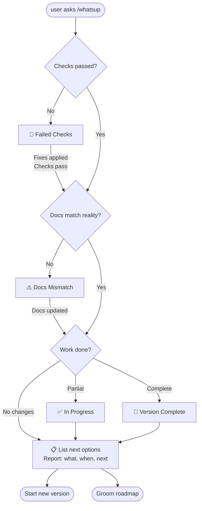

# What's Up? (Project Status Check)

**Purpose:** Universal pre-commit workflow ensuring documentation-code parity and stability.

**When to use:** Before EVERY commit, especially after long breaks or major changes.

**🚨 CRITICAL RULE:** Never push until ALL checks from CHECKS (see [README](/README.md)) pass. Return to fix or ask for clarification.

---

### Possible Outcomes



---

**What this means:**

1. **Read README** to find where status files live (always project-specific)
2. **Compare** actual work with documented plans
3. **Validate** stability using CHECKS (check [README](/README.md) for location)
4. **Update** docs automatically (ROADMAP → CHANGELOG)
5. **Determine outcome** (1 of 5 possible states)
6. **Act** (push, fix, or groom)

---

## 📋 STEP 0: Read README for Status Files Location

**AI: README is the ONLY source of truth for file locations AND navigation block**

**🚨 CRITICAL: READ-ONLY**

- ✅ **READ** README to find status files locations
- ✅ **COPY** navigation block (🤖 markers) from README to all status files
- ❌ **DO NOT EDIT** README without explicit user permission
- ❌ **DO NOT** create custom navigation - always copy from README
- README is the entry point - changes affect entire project discovery

### Read README First

```bash
# Step 1: Read README.md
cat README.md | head -50

# Step 2: Look for 🤖 navigation block
# Example output should show:
# > 🤖
# >
# > [CHANGELOG](...) - What we did
# > [ROADMAP](...) - What we wanna do
# > [CONTRIBUTING](...) - How we do it
# > [CHECKS](...) - What we accept
# >
# > [/whatsup](...) - The prompt that keeps us sane
# >
# > 🤖
```

### Extract Navigation Block

**What README MUST contain:**

```markdown
> 🤖
>
> [CHANGELOG](engine/docs/CHANGELOG.md) - What we did
> [ROADMAP](engine/docs/ROADMAP.md) - What we wanna do
> [CONTRIBUTING](.github/CONTRIBUTING.md) - How we do it
> [CHECKS](engine/docs/CHECKS.md) - What we accept
>
> [/whatsup](.github/prompts/whatsup.prompt.md) - The prompt that keeps us sane
>
> 🤖
```

**AI: Copy this block to ALL status files:**

- Adjust paths relative to each file's location
- Keep exact same format and descriptions
- This ensures consistency across the project

**🚨 CRITICAL: Verify navigation blocks in all status files**

Before proceeding, check if navigation blocks in status files match README:

```bash
# Compare navigation blocks
grep -A 10 "^> 🤖" README.md
grep -A 10 "^> 🤖" engine/docs/CHANGELOG.md
grep -A 10 "^> 🤖" engine/docs/ROADMAP.md
grep -A 10 "^> 🤖" .github/CONTRIBUTING.md
grep -A 10 "^> 🤖" engine/docs/CHECKS.md
```

**If mismatch found:**

- ✅ **Auto-fix:** Update all status files to match README format
- ✅ Adjust paths relative to each file's location
- ✅ Keep exact same order and descriptions as README

**If README doesn't have navigation block:**

- ❌ **STOP:** Ask user "Where are your status files? (e.g., /docs/, /engine/docs/, root)"
- ✅ Update README to document location
- ✅ Create from templates if needed (see end of this file)

---

## 📊 STEP 1: Compare Work vs Documentation

**AI: What actually changed vs what's documented?**

### 1A. Analyze Actual Changes

```bash
# What files changed?
git diff --name-status

# What code changed?
git diff --stat

# What commits since last release?
LAST_VERSION=$(grep -m1 "^## v" CHANGELOG.md | cut -d' ' -f2)
git log --oneline "${LAST_VERSION}..HEAD" || git log --oneline -5
```

**Categorize changes:**

- [ ] Bug fixes only → Patch version (v0.2.0 → v0.2.1)
- [ ] New features, backward compatible → Minor version (v0.2.x → v0.3.0)
- [ ] Breaking changes → Major version (v0.x → v1.0)

### 1B. Check ROADMAP

**AI: Read ROADMAP (check [README](/README.md) for location) and find matching features:**

```bash
# For Personal Library:
cat engine/docs/ROADMAP.md | grep "🔶 (IN PROGRESS)\|❌ (PLANNED)" -A 20

# Generic:
cat ROADMAP.md | grep -Ei "in progress|planned|todo" -A 20
```

**Questions to answer:**

- [ ] Did we complete a ROADMAP feature?
- [ ] Did we work on something NOT in ROADMAP? (document it)
- [ ] Are ROADMAP checkboxes accurate? (update them)

### 1C. Match Reality to Plans

**AI: Create comparison report:**

```markdown
## Work vs Documentation Analysis

**What I found in git:**

- Changed files: [list]
- Type of change: [patch/minor/major]
- Estimated scope: [1 feature / multiple / refactor]

**What ROADMAP says:**

- Listed as: [version section, e.g., "v0.3: Delta Indexing"]
- Status: [IN PROGRESS / PLANNED / not mentioned]
- Checkboxes: [X done / Y pending]

**Match?**

- ✅ YES: ROADMAP accurately reflects what we did
- ❌ NO: Need to update [ROADMAP/CHANGELOG]
  - Action: [move to CHANGELOG / update checkboxes / add new section]
```

---

## 🧪 STEP 2: Run Stability Checks (MANDATORY)

**🚨 CRITICAL:** Do NOT proceed to STEP 3 unless ALL checks pass.

### 2A. Read CHECKS

**AI: CHECKS contains all project-specific tests (check [README](/README.md) for location):**

```bash
# Read from location specified in README
cat [STATUS_FILES_LOCATION]/CHECKS.md

# Look for "For AI:" or "Automated test sequence" section
# It will contain exact commands to run
```

**If CHECKS doesn't exist (check [README](/README.md) for location):**

- ❌ **STOP:** "I don't see CHECKS. What tests must pass before pushing?"
- ✅ Create CHECKS from user input (use template below)

### 2B. Execute Tests from CHECKS

**Run the test script found in CHECKS:**

- Look for bash script block
- Execute it
- Capture all output

**Example output:**

```
🔍 Running stability checks...

1️⃣ Server startup test...
✅ Server starts

2️⃣ Dependencies test...
✅ Dependencies OK

3️⃣ File structure test...
✅ Files exist

✅ All checks complete.
```

**Note:** CHECKS location specified in [README](/README.md)

### 2C. Validation Gate

**AI: Report results in table:**

```markdown
## Stability Check Results

| Test     | Status | Output         |
| -------- | ------ | -------------- |
| [Test 1] | ✅/❌  | [brief result] |
| [Test 2] | ✅/❌  | [brief result] |

**Overall:** [✅ ALL PASS / ❌ X FAILURES]
```

**Decision tree:**

- ✅ **All pass:** Proceed to STEP 3
- ❌ **Any fail:**

  ```
  🛑 STOP: Cannot push until checks pass.

  Failed: [test names]

  Options:
  1. Fix the issue and re-run checks
  2. Ask me to clarify the requirement
  3. Document as known issue (add to ROADMAP)

  What would you like to do?
  ```

---

## ✏️ STEP 3: Update Documentation

**AI: Automatically update status files based on STEP 1 analysis**

### 3A. Update ROADMAP

**Location:** Check [README](/README.md) for status files location.

**Epic Format:**

> 🤖 **CRITICAL:** Always read epic format from [CONTRIBUTING.md](../.github/CONTRIBUTING.md#epic-format)
> User may customize syntax - NEVER use hardcoded format

**To write epics correctly:**

1. Read CONTRIBUTING.md section "Epic Format"
2. Find the `> 🤖 **AI: Use this syntax when writing epics` marker
3. Use that exact syntax for all epic writes
4. Respect status indicators (🚧 with link, ⏳ without link, ✅ completed)

**If feature completed:**

```markdown
# Before (in ROADMAP):

> **v0.3**
> [🚧](link) **Delta Indexing**

- [x] Topic-partitioned storage
- [ ] Automated change detection ← THIS WAS DONE

# After (AI updates):

> **v0.3**
> [🚧](link) **Delta Indexing**

- [x] Topic-partitioned storage
- [x] Automated change detection ← MARKED COMPLETE
```

**If version fully complete:**

- Move entire section from ROADMAP to CHANGELOG (check [README](/README.md) for locations)
- Change status emoji: `🚧` → `✅`
- Add completion date

**🤖 CRITICAL: Add Navigation Menu to ALL Status Files**

Every status file (ROADMAP, CHANGELOG, CHECKS) must end with this navigation menu:

```markdown
---

> 🤖: See [ROADMAP](path/to/ROADMAP.md) for planned features & in-progress work
> 🤖: See [CHANGELOG](path/to/CHANGELOG.md) for version history & completed features
> 🤖: See [CHECKS](path/to/CHECKS.md) for stability requirements & testing
> 👷: Consider using [/whatsup prompt](https://github.com/nonlinear/nonlinear.github.io/blob/main/.github/prompts/whatsup.prompt.md) for updates
```

**Important:** Adjust paths relative to each file's location:

- If file is in `/engine/docs/ROADMAP.md`, links are: `ROADMAP.md`, `CHANGELOG.md`, `CHECKS.md`, `../../.github/prompts/whatsup.prompt.md`
- If file is in `/docs/ROADMAP.md`, links are: `ROADMAP.md`, `CHANGELOG.md`, `CHECKS.md`, `../.github/prompts/whatsup.prompt.md`
- If file is in root `/ROADMAP.md`, links are: `ROADMAP.md`, `CHANGELOG.md`, `CHECKS.md`, `.github/prompts/whatsup.prompt.md`

**When to add menu:**

- When creating new status files
- When updating existing status files (if menu is missing or outdated)
- Place menu AFTER all content, before "Last updated" timestamp (if exists)

### 3B. Update CHANGELOG

**Location:** Check [README](/README.md) for status files location.

**🚨 CRITICAL RULE: CHANGELOG is append-only**

- ✅ **ADD new entries at the top** (newest first)
- ❌ **NEVER edit old entries** (history is immutable)
- ✅ **If mistake in old entry:** Add clarification/correction as NEW entry
- 📝 **Rename/refactor?** Document in NEW entry, keep old names in history

**Why:** CHANGELOG is historical record of what actually happened at that time. If old entry says "query_partitioned.py", that's what existed then. Don't rewrite history.

**Example - The RIGHT way:**

```markdown
## v0.5.0 - 2026-01-20 (NEW ENTRY - documents rename)

### Renamed for Clarity

- Scripts: query_partitioned.py → research.py (matches research.prompt.md)
  ...

## v0.3.0 - 2026-01-19 (OLD ENTRY - left unchanged)

- Added: query_partitioned.py for CLI queries
```

**AI: Add new entry following project format:**

```markdown
## v0.3: Delta Indexing ✅ (Jan 19, 2026)

**👥 Who needs to know:**

- Users with large libraries who reindex frequently

**📦 What's new:**

- [x] Automated change detection (scripts/update_delta.py)
- [x] Compare filesystem vs metadata.json
- [x] Incremental reindexing (23× faster)

**Impact:** Only changed books reindex, saves time

**🔧 Migration:** None (backward compatible)
```

### 3C. Version Bumping

**AI: Determine next version:**

```bash
# Get current version from CHANGELOG
CURRENT=$(grep -m1 "^## v" CHANGELOG.md | sed 's/^## v//' | cut -d':' -f1 | tr -d ' ')

# Based on STEP 1 categorization:
# Patch: v0.2.0 → v0.2.1
# Minor: v0.2.1 → v0.3.0
# Major: v0.9.0 → v1.0.0
```

**Update version references:**

- [ ] CHANGELOG (add new entry at top) - check [README](/README.md) for location
- [ ] package.json / setup.py / Cargo.toml (if exists)
- [ ] README.md (if version mentioned)

---

## 👤 STEP 4: Developer Context Summary

**AI: Generate outcome-based summary for the developer**

---

### 🛑 Failed Checks

**When:** STEP 2 checks failed

**AI reports:**

```markdown
## 🛑 CANNOT PUSH - Checks Failed

**Failed tests:**

1. [Test name] - [Error message]
2. [Test name] - [Error message]

**Problem:**
[Explain what's wrong in plain language]

**Suggested fixes:**

1. [Specific action to take]
2. [Alternative approach]

**Options:**

- Fix the issue and re-run whatsup
- Ask me to clarify the requirement
- Document as known issue in ROADMAP

What would you like to do?
```

**After fixes → Re-run /whatsup → Continues to stable state**

---

- Fix the issue and re-run whatsup
- Ask me to clarify the requirement
- Document as known issue in ROADMAP

What would you like to do?

````

---

### ⚠️ Docs Mismatch

**When:** Code changed but docs don't reflect it

**AI automatically updates docs, then provides stable state report:**

```markdown
## ⚠️ Documentation Updated → Stable State

**What I found:**

- You worked on: [feature]
- ROADMAP said: [old status]
- Reality: [new status]

**Auto-updates made:**

- ROADMAP: Marked [X] items complete
- CHANGELOG: [Created new entry / Updated existing]
- Version: v${OLD} → v${NEW}

**✅ Pushed and stable**

---

## 📋 What's Next?

**⏰ When:** Last worked [time ago]

**🔨 What you did:** [feature summary]

**🎯 Current status:**
- Version: v${NEW}
- Progress: [X/Y] items complete
- All checks: ✅ Passing

**🔮 Next options:**

1. **Continue v${NEW}:** [Next unchecked item]
2. **Start v${NEXT}:** [New feature from ROADMAP]
3. **Groom ROADMAP:** Replan priorities
````

---

### 📋 List Next Options

**When:** No uncommitted changes, already in stable state

**AI provides "List next options" report:**

```markdown
## 🧑 Grooming Mode → What's Next?

**✅ Current state: Stable**

**⏰ When:** Last worked [time ago]

**🎯 Current status:**

- Version: v${CURRENT}
- All checks: ✅ Passing
- No uncommitted changes

---

## 📋 What's Next?

**From ROADMAP, you could work on:**

1. **v${NEXT_MINOR}: [Feature name]** (🔶 IN PROGRESS)
   - [x] [Done item]
   - [ ] [Next item] ← Continue here?

2. **v${NEXT_MAJOR}: [Feature name]** (❌ PLANNED)
   - [ ] [First item] ← Start something new?

3. **Future Ideas:**
   - [Nice to have items]

**Or:** What else would you like to work on?
```

---

### ✅ In Progress

**When:** Checks pass, some checkboxes done, version not complete

**AI updates checkboxes, pushes, then provides stable state report:**

```markdown
## ✅ Progress Update → Stable State

**⏰ When:** Last worked [time ago]

**🔨 What you did:**

- Completed: [feature item]
- Files changed: [list]
- Commits: [N]

**📦 Updated & Pushed:**

- ROADMAP: Marked [item] as complete
- Version: v${VERSION} (in progress)
- Checks: ✅ All passed

**Commit message:**
```

progress: [feature name] - [what you completed]

Version: v${VERSION} (in progress)
Completed: [item]
Checks: ✅ All passed
Updated: ROADMAP

```

**✅ Pushed and stable**

---

## 📋 What's Next?

**🎯 Current status:**
- Version: v${VERSION}
- Progress: [X/Y] items complete
- Status: 🔶 IN PROGRESS

**🔮 Next options:**

1. **Continue v${VERSION}:** [Next unchecked item from ROADMAP]
2. **Start v${NEXT}:** [New feature from ROADMAP]
3. **Groom ROADMAP:** Replan priorities
```

---

### 🎉 Version Complete

**When:** All checkboxes done for a version, checks pass

**AI moves to CHANGELOG, pushes & celebrates, then provides stable state report:**

```markdown
## 🎉 Version Complete! → Stable State

**⏰ Timeline:**

- Started: [date from git]
- Completed: [today]
- Duration: [time span]

**🎯 What we built:**
v${VERSION}: [Feature name]

- [x] [All completed items]

**📊 Impact:**
[From ROADMAP description - who benefits, why it matters]

**📦 Updates made & Pushed:**

- Moved ROADMAP → CHANGELOG
- Status: 🔶 IN PROGRESS → ✅ COMPLETED
- Version bumped: v${OLD} → v${NEW}
- Checks: ✅ All passed

**Commit message:**
```

release: v${VERSION} - [feature name]

✅ All features complete
Checks: ✅ All passed
Updated: ROADMAP → CHANGELOG

See CHANGELOG for full details

```

**✅ Pushed and stable**

---

## 📋 What's Next?

**📣 Announce to users?**

- Post in [Signal group / Discord / wherever]
- Link: [CHANGELOG#v${VERSION}]
- Tweet: "Just shipped v${VERSION}: [one-liner]"

**🔮 Next options:**

1. **Start v${NEXT}:** [New feature from ROADMAP]
2. **Groom ROADMAP:** Plan future versions
3. **Break:** Take a well-deserved rest! 🎉
```

---

**Commit message:**

```

release: v${VERSION} - [feature name]

✅ All features complete
Checks: ✅ All passed
Updated: ROADMAP → CHANGELOG

See CHANGELOG for full details (check [README](/README.md) for location)

```

````

### Time & Context Analysis (All Outcomes)

```bash
# Time analysis
LAST_COMMIT_DATE=$(git log -1 --format="%ai" 2>/dev/null)
TIME_AGO=$(git log -1 --format="%ar" 2>/dev/null)

# Change summary
LAST_TAG=$(git describe --tags --abbrev=0 2>/dev/null || echo "HEAD~10")
COMMITS_SINCE=$(git log --oneline ${LAST_TAG}..HEAD 2>/dev/null | wc -l)
FILES_CHANGED=$(git diff --name-only ${LAST_TAG}..HEAD 2>/dev/null | wc -l)
````

**AI: Present this to user:**

```markdown
## 📊 Developer Context

**⏰ When:** Last worked on this ${TIME_AGO}

- Last commit: ${LAST_COMMIT_DATE}
- Since last release: ${COMMITS_SINCE} commits, ${FILES_CHANGED} files changed

**🔨 What:** [Brief description from commit messages]

- Version: ${OLD_VERSION} → ${NEW_VERSION}
- Type: [patch/minor/major]

**🎯 Why:** [From ROADMAP/CHANGELOG description]

- Goal: [what we were trying to achieve]
- Result: [what we actually achieved]

**✅ Status:**

- ROADMAP: [X features complete, Y pending in current version]
- Stability: [✅ All checks passed / ❌ X failures]
- Documentation: [✅ Updated / ⚠️ Needs review]

**🔮 What's Next:** [From ROADMAP]

1. [Next planned feature from ROADMAP]
2. [Or] "No roadmap items - what do you want to work on next?"

**🚦 Ready to push?** [✅ YES - all checks passed / ❌ NO - fix issues first]
```

---

## ✅ STEP 5: Decision Point

**AI: Based on STEP 4 outcome, take appropriate action:**

### If Outcome 1 (Failed Checks): 🛑 STOP

```
Cannot push until issues are resolved.
Return to STEP 2 after fixes.
```

### If Outcome 2-5 (Checks Passed): Final Checklist

```markdown
## Pre-Push Validation

- [x] STEP 0: README read, status files located
- [x] STEP 1: Work matches documentation
- [x] STEP 2: ALL stability checks passed ← MANDATORY
- [x] STEP 3: Documentation updated (if needed)
- [x] STEP 4: Developer informed of outcome

🚦 **Status:** SAFE TO PUSH

**Outcome:** [1-5 from STEP 4]
**Action:** [Use commit message from STEP 4 outcome]
```

**If Outcome 3 (Grooming):**

- No commit needed
- Just planning next work
- Update ROADMAP if priorities changed

**If Outcomes 2, 4, or 5:**

- Use commit message from STEP 4 outcome
- Push to main
- If Outcome 5: Announce release!

---

## 🎯 Quick Reference: The 5 States

| State               | When         | Action            | Can Push? |
| ------------------- | ------------ | ----------------- | --------- |
| 🛑 Failed Checks    | Tests fail   | Fix issues        | ❌ NO     |
| ⚠️ Docs Mismatch    | Code ≠ docs  | Auto-update docs  | ✅ YES    |
| 🧑 Grooming         | No changes   | Plan next work    | N/A       |
| ✅ In Progress      | Partial work | Update checkboxes | ✅ YES    |
| 🎉 Version Complete | All done!    | Move to CHANGELOG | ✅ YES 🎉 |

---

## 🎯 Quick Reference: Three Audiences

### 1. 👤 Developer (You)

**Gets from STEP 4:**

- When: "Last worked 2 months ago"
- What: "Completed delta indexing feature"
- Why: "To avoid reindexing entire library"
- Next: "v0.4 Provider Integration OR..."

### 2. 👥 Users

**Gets from CHANGELOG:** (check [README](/README.md) for location)

- What's new: "Delta indexing - 23× faster"
- Who cares: "Large library users"
- Migration: "None - backward compatible"

### 3. 🤖 AI Assistant

**Gets from all files:** (check [README](/README.md) for locations)

- Code state: [from CHECKS tests]
- Planned work: [from ROADMAP]
- Completed work: [from CHANGELOG]
- Truth source: [documentation matches code]

---

## 📖 Templates for New Projects

**If README doesn't specify status files location, create them:**

### Ask User for Location

```
I don't see status files listed in README.md.

Where should I create them?
1. Root directory (/, simpler)
2. /docs/ (organized)
3. /engine/docs/ (complex projects)
4. Other location?
```

### Template Structure

All status files should include navigation menu pointing to actual location:

```markdown
**📋 Project Status Files:**
**Location:** [actual location - e.g., /docs/]

- README - Entry point (check README for links)
- ROADMAP - Planned features (check README for links)
- CHANGELOG - Version history (check README for links)
- CHECKS - Stability tests (check README for links)
```

**No hardcoded paths in whatsup.prompt.md** - README is the only source of truth for all file locations.

---

## 🎯 The 3-Level System

This prompt is **Level 3** - the most abstract layer:

### Level 1: Personal (Not tracked)

- Your own books indexed
- Your personal notes
- Your local configuration
- **Not part of any project**

### Level 2: Project-Specific (Personal Library MCP)

- Generic tool others can use
- Users add their own books
- AI retrieval via `/research` prompt
- **Example flagship project for Level 3**

### Level 3: Meta-Workflow (whatsup.prompt.md)

- **This file** - works for ANY project
- Uses Personal Library as working example
- No hardcoded paths or project detection
- Reads README to find everything
- **Can be copied to any project**

**The Hierarchy:**

```
whatsup.prompt.md (agnostic workflow)
  ↓ Uses as example ↓
Personal Library MCP (project with status files)
  ↓ User-specific ↓
Your books (not tracked, personal)
```

---

## 🎯 Quick Summary

**The Model:**

1. **README** → ONLY source of truth for file locations
2. **whatsup.prompt.md** → Reads README, stays agnostic, works everywhere
3. **Status Files** → Project-specific (tests, versioning, features)

**Flow:**

```
AI needs to commit
  ↓
Read README (where are status files?)
  ↓ If not found → ask user, create them
Read status files (what are the specifics?)
  ↓
Run workflow (5 steps → 5 outcomes)
  ↓
✅ Push or 🛑 Fix or 🧑 Groom
```

---

**Last updated:** 2026-01-19
**Version:** 4.0 (Fully agnostic, 3-level system, README-only discovery)
**Flagship example:** Personal Library MCP (Level 2 project)
