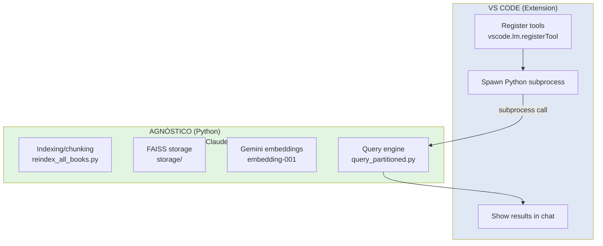

# Personal Library - VS Code Implementation

Thin wrapper extension that makes your personal book library searchable in GitHub Copilot Chat.

## Quick Start

```bash
# 1. Index your books (one-time setup)
python3 scripts/reindex_all_books.py

# 2. Install extension
code --install-extension personal-library-mcp-latest.vsix

# 3. Use in GitHub Copilot Chat
/research "what does the book say about infrastructure?"
```

## Available Topics

AI • activism • anthropocene • fiction • oracles • urbanism • usability

## Architecture



**Zero lock-in:** Python code works independently of VS Code

## Tools Registered

- `query_library` - Search book content
- `list_topics` - List available topics
- `list_books` - List books (all or by topic)

## Development

```bash
cd .vscode/extensions/personal-library-mcp
npm install
npm run compile
vsce package --allow-missing-repository -o personal-library-mcp-latest.vsix
```
