```mermaid
%%{init: {'theme':'base', 'themeVariables': { 'fontSize':'14px'}}}%%
graph LR
    subgraph "✅ Done"
        V1[v1.0.0<br/>Renaming<br/><small>Personal Library → Librarian</small>]
    end

    subgraph "🎯 Ready"
        V11[v1.1.0<br/>Hygiene]
        V12[v1.2.0<br/>User Testing]
    end

    subgraph "⏳ Blocked/Waiting"
        V14[v1.4.0<br/>Citation Expression<br/><small>VS Code limitation</small>]
        V13[v1.3.0<br/>Better Feedback]
    end

    subgraph "📅 Future"
        V15[v1.5.0<br/>FAILED→REPORT]
        V16[v1.6.0<br/>Error Handling]
        V17[v1.7.0<br/>Multi-User]
        V2[v2.0.0<br/>Admin Generalization<br/><small>Status files repo</small>]
    end

    V1 --> V11
    V1 --> V12
    V11 --> V13
    V12 --> V13
    V13 --> V14
    V14 --> V15
    V15 --> V16
    V16 --> V17
    V17 --> V2

    style V1 fill:#90EE90
    style V13 fill:#FFE4B5
    style V2 fill:#E6E6FA
```

# Project Policy

> 🤖
>
> - [README](../README.md) - Our project
> - [CHANGELOG](CHANGELOG.md) — What we did
> - [ROADMAP](ROADMAP.md) — What we wanna do
> - [POLICY](POLICY.md) [project](POLICY.md) / [global](global/POLICY.md) — How we do it
> - [CHECKS](CHECKS.md) — What we accept
> - 👷 Wanna collaborate? Connect via [signal group](https://signal.group/#CjQKIKD7zJjxP9sryI9vE5ATQZVqYsWGN_3yYURA5giGogh3EhAWfvK2Fw_kaFtt-MQ6Jlp8)
>
> 🤖



---

## Universal Workflow

**This project follows the [global MGMT policy](global/POLICY.md)** for:

- Epic/branch workflow ("Epic Dance")
- Semantic versioning
- Branch strategy
- Commit messages
- Rebase vs merge rules
- Pre-commit workflow

**This file contains only Librarian-specific rules and deviations.**

---

## 🚨 About This Project

**This is a personal library management system - NOT a collaborative repository.**

Each person runs their own instance with their own books. Nothing syncs to GitHub except code/scripts.

**Want to contribute code?** Contact me first to discuss environment setup - don't submit PRs directly.

**Just want to use it?** Fork it, clone it, use it. Your books/data stay 100% local.

### Setup After Clone

**1. Verify `.git/info/exclude` exists:**

```bash
cat .git/info/exclude
```

Expected content:

```
# BYOB: Bring Your Own Books/Models - Local files (don't sync to GitHub)
books/**/*.epub
books/**/*.pkl
books/**/*.index
books/metadata.json
models/
```

**Why:** Keeps your library private + enables autocomplete for book links. See [gaps/epic-notes/v0.4.0.md](gaps/epic-notes/v0.4.0.md#autocomplete-investigation) for technical details.

**2. Add your books:**

```bash
# Organize books from Downloads
python3.11 .github/scripts/organize_books.py

# Generate metadata + indices
python3.11 scripts/indexer.py
```

---

## Librarian-Specific Versioning

| Type      | Version Change  | Requires Reindex? | Breaking? |
| --------- | --------------- | ----------------- | --------- |
| **Patch** | v0.2.0 → v0.2.1 | No                | No        |
| **Minor** | v0.2.x → v0.3.0 | Optional          | No        |
| **Major** | v0.x → v1.0     | Yes               | Yes       |

**Reindexing requirement examples:**

- ✅ **Requires reindex:** Schema changes, new embedding models, chunking algorithm changes
- ❌ **No reindex needed:** UI changes, prompt updates, MCP server improvements

---

## Epic Creation Rules

**If two features can be delivered separately, create separate epics.**

Example:
- ✅ Good: `v1.1.0: Hidden Files` + `v1.2.0: User Testing` (separate)
- ❌ Bad: `v1.1.0: Hygiene + Testing + Docs` (monolithic)

---

**Last updated:** 2026-01-26  
**Version:** 1.1 (Decoupled from global policy)

Each person runs their own instance with their own books. Nothing syncs to GitHub except code/scripts.

**Want to contribute code?** Contact me first to discuss environment setup - don't submit PRs directly.

**Just want to use it?** Fork it, clone it, use it. Your books/data stay 100% local.

### Setup After Clone

**1. Verify `.git/info/exclude` exists:**

```bash
cat .git/info/exclude
```

Expected content:

```
# BYOB: Bring Your Own Books/Models - Local files (don't sync to GitHub)
books/**/*.epub
books/**/*.pkl
books/**/*.index
books/metadata.json
models/
```

**Why:** Keeps your library private + enables autocomplete for book links. See [gaps/epic-notes/v0.4.0.md](gaps/epic-notes/v0.4.0.md#autocomplete-investigation) for technical details.

**2. Add your books:**

```bash
# Organize books from Downloads
python3.11 .github/scripts/organize_books.py

# Generate metadata + indices
python3.11 scripts/indexer.py
```

---

## Branch Strategy

**One branch per epic:**

```
main (stable releases only)
  ↓
v0.3-delta-indexing (feature branch)
v0.4-provider-integration (feature branch)
v0.5-automation (feature branch)
```

### Branch Naming

## Status Files Index

**Examples:**

- `v0.3-delta-indexing`
- `v0.4-provider-integration`
- `v1.0-breaking-changes`

### Workflow

1. **Create branch from main:**

## Epic/Branch Workflow ("Epic Dance")

### 🔍 Before Starting New Work: Review Epic Notes

**CRITICAL:** Always check existing epic notes before starting similar work to avoid reinventing the wheel.

```bash
# List all epic notes
ls engine/docs/gaps/epic-notes/

# Search for relevant keywords
grep -r "keyword" engine/docs/gaps/epic-notes/
```

**Why epic notes matter:**

- **Discovered blockers:** Previous epics may have hit technical limitations
  - Example: v0.4.0 found VS Code pill validation breaks with `#` fragments
- **Tested solutions:** Multiple approaches already tried and documented
  - Example: v0.4.0 tested 6 different anchor syntaxes (all failed)
- **Documented workarounds:** Pragmatic solutions when ideal ones don't work
- **Deferred features:** Features intentionally postponed with reasoning

**When to check:**

- Starting any new epic (especially similar features)
- Encountering unexpected behavior
- Considering a feature that "feels like it was tried before"
- Planning technical approaches

**Epic notes = knowledge base** - Treat them as first-class documentation, not just session logs.

---

### Step 1: Groom Epic in ROADMAP (on main)

**Before creating branch:**

1. **Add epic to ROADMAP.md** as next v0.X.0 (top of list)
2. **Renumber all existing epics** (+1 each)
3. **Update mermaid subway map** at top of ROADMAP.md:
   - Add new node for epic
   - Place in correct subgraph (Ready/Blocked/Future)
   - Add dependency arrows if needed
   - Update node styles (colors) based on status
4. **Write epic with:**
   - ⏳ Status indicator (planned, no branch yet)
   - Problem statement
   - Solution approach
   - Task checklist
5. **Review and refine** tasks (can spend time here)

> 🤖 **AI: Always update mermaid graph when adding/moving/completing epics**

**Example:**

```markdown
## v0.4.0

### Source Granularity

⏳ Add page/chapter granularity to citations

**Problem:** Citations require manual Ctrl+F
**Solution:** PDF `#page=N`, EPUB chapter links

**Tasks:**

- [ ] Test VS Code extensions
- [ ] Extract page numbers during PDF chunking
      ...
```

### Step 2: Name Conversation

**AI conversation title:** `v0.X.0: Epic Title`

Example: `v0.4.0: Source Granularity`

### Step 3: Create Branch

```bash
git checkout main
git pull origin main
git checkout -b v0.X.0  # Just version number, no descriptive name
```

**Branch naming:** `v0.X.0` (no epic name, just version)

### Step 4: Update ROADMAP with Branch Link

Replace ⏳ with 🚧 and add branch link:

```markdown
## v0.4.0

### [🚧](https://github.com/user/repo/tree/v0.4.0) Source Granularity
```

**Format:** `### [🚧](branch-url) Epic Title`

### Step 5: Create Epic Notes

**Structure (v0.4.0 and earlier):**

```
engine/docs/gaps/epic-notes/v0.X.0.md  # Single file for all notes
```

**Structure (v0.5.0+):**

```
engine/docs/gaps/epic-notes/v0.X.0/
  ├── MAIN.md                      # Primary epic documentation
  ├── pill-validation.md           # Specific finding/experiment
  └── autocomplete-fix.md          # Another finding
```

Add notes link to ROADMAP on same line as branch:

```markdown
### [🚧](branch-link) Source Granularity | [notes](gaps/epic-notes/v0.4.0.md)

# OR for folder structure:

### [🚧](branch-link) Source Granularity | [notes](gaps/epic-notes/v0.4.0/)
```

**Notes purpose:**

- Session summaries (in MAIN.md)
- Experiments and discoveries (separate files in v0.5.0+)
- Testing results and root cause analysis
- Implementation blockers and workarounds

**When to use folder structure:**

- Epic has multiple distinct findings (>3)
- Single file exceeds ~500 lines
- Findings are independent enough to reference separately

**Migration:** When converting v0.X.0.md → v0.X.0/, rename to MAIN.md and extract major findings to separate files.

### Step 6: Push Main Changes

```bash
git checkout main
git add engine/docs/ROADMAP.md  # Updated with links
git commit -m "docs: add v0.X.0 epic to roadmap"
git push origin main
```

**Typical main changes when starting epic:**

- ROADMAP.md (epic + renumbering + links)
- Sometimes: prompts (if epic requires new prompt)

### Step 7: Work on Epic (in branch)

```bash
git checkout v0.X.0
git add .
git commit -m "feat: implement feature"
git push origin v0.X.0
```

### Step 8: Stay Current - Rebase Regularly

```bash
git checkout main
git pull origin main
git checkout v0.X.0
git rebase main
git push --force-with-lease origin v0.X.0
```

**Why rebase?**

- Keeps linear history
- Easier to review
- Cleaner when merging back to main

  **When to rebase?**
  - Daily if main is active
  - Before creating PR
  - After major main updates

5. **Before merging - use `/whatsup`:**

   ```bash
   # Run pre-commit workflow (does steps 6-7 automatically)
   # See .github/prompts/whatsup.prompt.md
   ```

   **The `/whatsup` workflow will:**
   - ✅ Run all CHECKS (see engine/docs/CHECKS.md)
   - ✅ Update ROADMAP (mark completed checkboxes)
   - ✅ Move epic to CHANGELOG (if complete)
   - ✅ Bump version number (semantic versioning)
   - ✅ Generate commit message

6. **Merge to main when epic complete:**

   ```bash
   git checkout main
   git pull origin main
   git merge v0.3-delta-indexing --no-ff

   # Tag the release
   git tag v0.3.0 -m "Epic v0.3: Delta Indexing complete"

   git push origin main
   git push origin v0.3.0
   ```

7. **Delete feature branch (recommended):**

   ```bash
   # Local
   git branch -d v0.3-delta-indexing

   # Remote (optional - keeps history clean)
   git push origin --delete v0.3-delta-indexing
   ```

   **Branch deletion policy:**
   - ✅ **DO delete** after successful merge (keeps branch list clean)
   - ✅ Git history preserved via tags
   - ✅ Can recreate from tag if needed: `git checkout -b v0.3-delta-indexing v0.3.0`
   - ❌ **DON'T delete** if you plan to make hotfixes on that version

8. **Announce release:**
   - Update [README.md](../README.md) status section (links to new CHANGELOG entry)
   - Post in [Signal group](https://signal.group/#CjQKIKD7zJjxP9sryI9vE5ATQZVqYsWGN_3yYURA5giGogh3EhAWfvK2Fw_kaFtt-MQ6Jlp8)
   - Tweet/share if public release

---

## Epic Format

> 🤖 **AI: Use this syntax when writing epics in ROADMAP or CHANGELOG**

**Syntax:**

```markdown
### v0.X

#### [🚧](link-to-branch) Epic Title

Epic description (what problem does this solve?)

- [ ] Task to complete (roadmap only)
- [x] Completed task (roadmap only)
- Completed task (changelog only, in past tense)

❌ Anti-pattern (what NOT to do)
✅ Best practice (with link if applicable)
🗒️ Note

---
```

**Status indicators:**

- `🚧` with link = active branch exists (in-progress epic)
- `⏳` no link = planned, no branch yet
- `✅` completed (changelog only)

**Examples:**

```markdown
> **v0.3**
> [🚧](https://github.com/user/repo/tree/v0.3-delta-indexing) **Delta Indexing**

Automatic change detection for incremental book indexing

- [x] Detect filesystem changes
- [ ] Auto-reindex affected topics

✅ Use folder_path from metadata for accuracy
❌ Don't parse topic_id with string splitting
```

---

## Epic Development Strategy

**Each epic = one feature branch:**

- Branch naming: `v{major}.{minor}-{feature-name}` (ex: `v0.3-delta-indexing`)
- Regular rebase from `main` to stay current
- When complete → merge to `main` → move to CHANGELOG.md

**When epic completes:**

1. Run `/whatsup` (marks checkboxes, validates checks)
2. Move entire epic from ROADMAP → CHANGELOG
3. Change status: `🚧` → `✅`
4. Merge branch to main with `--no-ff`
5. Tag release: `git tag v0.3.0 -m "Epic v0.3 complete"`
6. Delete feature branch (recommended, history preserved via tags)
7. Announce release

---

## Semantic Versioning

**For AI-assisted projects:**

| Type      | Version Change  | Requires Reindex? | Breaking? |
| --------- | --------------- | ----------------- | --------- |
| **Patch** | v0.2.0 → v0.2.1 | No                | No        |
| **Minor** | v0.2.x → v0.3.0 | Optional          | No        |
| **Major** | v0.x → v1.0     | Yes               | Yes       |

**Examples:**

- **Patch:** Bug fixes, typos, minor corrections
  - `fix: correct typo in metadata.json`
  - `fix: handle edge case in indexer`

- **Minor:** New features, backward compatible
  - `feat: add delta indexing support`
  - `feat: PDF support`

- **Major:** Breaking changes, architecture changes
  - `feat!: migrate to new storage format (BREAKING)`
  - `refactor!: change folder structure (requires reindex)`

---

## Rebase vs Merge

**Use rebase for:**

- ✅ Keeping feature branch current with main
- ✅ Cleaning up local history before pushing
- ✅ Maintaining linear git history

**Use merge for:**

- ✅ Integrating completed features into main
- ✅ Preserving complete feature development history
- ✅ Creating clear version boundaries

**Never rebase:**

- ❌ Public/shared branches after others have pulled
- ❌ Main branch itself
- ❌ After a branch has been merged

**Rebase conflicts?**

```bash
# During rebase, if conflicts occur:
git status                    # See conflicting files
# Fix conflicts in editor
git add <resolved-files>
git rebase --continue

# If rebase gets messy:
git rebase --abort           # Start over
```

---

## Commit Messages

**Format:**

```
<type>: <subject>

[optional body]
[optional footer]
```

**Types:**

- `feat:` New feature
- `fix:` Bug fix
- `docs:` Documentation only
- `refactor:` Code restructuring (no feature change)
- `test:` Adding tests
- `chore:` Maintenance (dependencies, build, etc.)

**Examples:**

```
feat: add delta indexing for books
fix: resolve STORAGE_DIR undefined error
docs: update ROADMAP with v0.3 epic
refactor: consolidate storage to books/ only
```

---

## Pre-Commit Workflow

**ALWAYS run before merging to main:**

1. **Use `/whatsup` prompt** (see [.github/prompts/whatsup.prompt.md](prompts/whatsup.prompt.md))
2. **Check CHECKS.md** for stability requirements (location in [README](/README.md))
3. **Update ROADMAP** - mark completed checkboxes
4. **Move to CHANGELOG** - if epic complete
5. **Run all tests** - ensure nothing broke

## Questions?

**Last updated:** 2026-01-20
**Version:** 1.0 (Initial workflow definition)
