```mermaid
%%{init: {'theme':'base', 'themeVariables': { 'fontSize':'14px'}}}%%
graph LR
    subgraph "✅ Done"
        V1[v1.0.0<br/>Renaming<br/><small>Personal Library → Librarian</small>]
    end

    subgraph "🎯 Ready"
        V11[v1.1.0<br/>Hygiene]
        V12[v1.2.0<br/>User Testing]
    end

    subgraph "⏳ Blocked/Waiting"
        V14[v1.4.0<br/>Citation Expression<br/><small>VS Code limitation</small>]
        V13[v1.3.0<br/>Better Feedback]
    end

    subgraph "📅 Future"
        V15[v1.5.0<br/>FAILED→REPORT]
        V16[v1.6.0<br/>Error Handling]
        V17[v1.7.0<br/>Multi-User]
        V2[v2.0.0<br/>Admin Generalization<br/><small>Status files repo</small>]
    end

    V1 --> V11
    V1 --> V12
    V11 --> V13
    V12 --> V13
    V13 --> V14
    V14 --> V15
    V15 --> V16
    V16 --> V17
    V17 --> V2

    style V1 fill:#90EE90
    style V13 fill:#FFE4B5
    style V2 fill:#E6E6FA
```

# Project Policy

> 🤖
>
> - [README](../README.md) - Our project
> - [CHANGELOG](CHANGELOG.md) — What we did
> - [ROADMAP](ROADMAP.md) — What we wanna do
> - [POLICY](POLICY.md) [project](POLICY.md) / [global](global/POLICY.md) — How we do it
> - [CHECKS](CHECKS.md) — What we accept
> - [/MGMT-start](../.github/prompts/MGMT-start.prompt.md) — Pre-commit validation
> - [/MGMT-end](../.github/prompts/MGMT-end.prompt.md) — Session wrap-up
> - 👷 Wanna collaborate? Connect via [signal group](https://signal.group/#CjQKIKD7zJjxP9sryI9vE5ATQZVqYsWGN_3yYURA5giGogh3EhAWfvK2Fw_kaFtt-MQ6Jlp8)
>
> 🤖



---

## Purpose

**This file contains Librarian-specific workflow rules and deviations.**

**For universal MGMT rules:** See [global/POLICY.md](global/POLICY.md) for:

- Epic/branch workflow ("Epic Dance")
- Semantic versioning
- Branch strategy
- Commit messages
- Rebase vs merge rules
- Pre-commit workflow
- Navigation block syntax

**Project vs Global:**

- **Global** (`MGMT/global/POLICY.md`): Universal rules for ANY project using MGMT
- **Project** (`MGMT/POLICY.md`): Librarian-specific rules that extend/override global
- **Precedence:** Project rules WIN when conflict exists

---

## Librarian-Specific Rules

### 🚨 About This Project

**This is a personal library management system - NOT a collaborative repository.**

Each person runs their own instance with their own books. Nothing syncs to GitHub except code/scripts.

**Want to contribute code?** Contact me first to discuss environment setup - don't submit PRs directly.

**Just want to use it?** Fork it, clone it, use it. Your books/data stay 100% local.

### Setup After Clone

**1. Verify `.git/info/exclude` exists:**

```bash
cat .git/info/exclude
```

Expected content:

```
# BYOB: Bring Your Own Books/Models - Local files (don't sync to GitHub)
books/**/*.epub
books/**/*.pkl
books/**/*.index
books/metadata.json
engine/models/
```

**Why:** Keeps your library private + enables autocomplete for book links. See [epic-notes/v0.4.0.md](epic-notes/v0.4.0.md#autocomplete-investigation) for technical details.

**2. Add your books:**

```bash
# Organize books from Downloads
python3.11 .github/engine/scripts/organize_books.py

# Generate metadata + indices
python3.11 engine/scripts/indexer.py
```

### Librarian-Specific Versioning

## Librarian-Specific Versioning

| Type      | Version Change  | Requires Reindex? | Breaking? |
| --------- | --------------- | ----------------- | --------- |
| **Patch** | v0.2.0 → v0.2.1 | No                | No        |
| **Minor** | v0.2.x → v0.3.0 | Optional          | No        |
| **Major** | v0.x → v1.0     | Yes               | Yes       |

**Reindexing requirement examples:**

- ✅ **Requires reindex:** Schema changes, new embedding models, chunking algorithm changes
- ❌ **No reindex needed:** UI changes, prompt updates, MCP server improvements

---

### Epic Creation Rules

**If two features can be delivered separately, create separate epics.**

Example:

- ✅ Good: `v1.1.0: Hidden Files` + `v1.2.0: User Testing` (separate)
- ❌ Bad: `v1.1.0: Hygiene + Testing + Docs` (monolithic)

---

**Last updated:** 2026-01-26
**Version:** 1.1 (Decoupled from global policy)
**Version:** 1.0 (Initial workflow definition)
