# Librarian MCP - Roadmap

> 🤖
>
> - [README](../README.md) - Our project
> - [CHANGELOG](CHANGELOG.md) — What we did
> - [ROADMAP](ROADMAP.md) — What we wanna do
> - [POLICY](POLICY.md) [project](POLICY.md) / [global](global/POLICY.md) — How we do it
> - [CHECKS](CHECKS.md) — What we accept
> - [/MGMT-start](../.github/prompts/MGMT-start.prompt.md) — Pre-commit validation
> - [/MGMT-end](../.github/prompts/MGMT-end.prompt.md) — Session wrap-up
> - 👷 Wanna collaborate? Connect via [signal group](https://signal.group/#CjQKIKD7zJjxP9sryI9vE5ATQZVqYsWGN_3yYURA5giGogh3EhAWfvK2Fw_kaFtt-MQ6Jlp8)
>
> 🤖

```mermaid
%%{init: {'theme':'base', 'themeVariables': { 'fontSize':'14px'}}}%%
graph LR
    subgraph "✅ Done"
        V1[v1.0.0<br/>Renaming<br/><small>Personal Library → Librarian</small>]
    end

    subgraph "🎯 Ready"
        V11[v1.1.0<br/>Hygiene]
        V12[v1.2.0<br/>User Testing]
    end

    subgraph "⏳ Blocked/Waiting"
        V14[v1.4.0<br/>Citation Expression<br/><small>VS Code limitation</small>]
        V13[v1.3.0<br/>Better Feedback]
    end

    subgraph "📅 Future"
        V15[v1.5.0<br/>FAILED→REPORT]
        V16[v1.6.0<br/>Error Handling]
        V17[v1.7.0<br/>Multi-User]
        V2[v2.0.0<br/>Admin Generalization<br/><small>Status files repo</small>]
    end

    V1 --> V11
    V1 --> V12
    V11 --> V13
    V12 --> V13
    V13 --> V14
    V14 --> V15
    V15 --> V16
    V16 --> V17
    V17 --> V2

    style V1 fill:#90EE90
    style V13 fill:#FFE4B5
    style V2 fill:#E6E6FA
```

---

## v1.1.0

[🚧](epic-notes/v1.1.0.md) **Hygiene + MGMT Generalization**

Repository structure improvements and status files system generalization. Combines folder reorganization with MGMT naming/structure.

**Part 1: MGMT System (DONE)**

- [x] Create MGMT/ folder for all meta-documentation
- [x] Move engine/docs/\* → MGMT/
- [x] Rename CONTRIBUTING.md → POLICY.md
- [x] Create global/ subfolder with universal MGMT framework
- [x] Update all navigation blocks
- [x] Rename prompts (whatsup → MGMT-start, wrap-it-up → MGMT-end)
- [x] Research and document polycentric governance philosophy
- [x] Add precedence rules (project overrides global)

**Part 2: Hidden Object Files (DONE)**

- [x] Update all scripts to use hidden filenames (.library-index.json, .chunks.json, .faiss.index, .topic-index.json)
- [x] Rename existing db files to hidden
- [x] Update .gitignore to track hidden files
- [x] Test on macOS (research.py works correctly)
- [x] Update CHECKS.md for new filenames

**Part 3: Repository Cleanup (DONE)**

- [x] Move requirements.txt → engine/requirements.txt
- [x] Move scripts/ → engine/scripts/
- [x] Move models/ → engine/models/
- [x] Create engine/logs/ for runtime logs
- [x] Fix all path references in 69 files
- [x] Update README installation instructions
- [x] Test all scripts work with new paths
- [x] Delete legacy log files from root
- [x] Remove old engine/docs/ folder (duplicate of MGMT/)

## v1.2.0

### User testing

Test repo from the start, change docs or setup to comply.

- [ ] End-to-end repo setup validation
- [ ] Update documentation for onboarding
- [ ] Add setup engine/scripts/checks for new users
- [ ] Collect feedback from first-time users

## v1.3.0

### Better feedback loop

Improve feedback and interaction for users and contributors (includes VS Code Extension Configuration and Direct mentions).

- [ ] Rethink what an extension can do and if we even need it
- [ ] Discuss possibility of extension
- [ ] Examples to copy
- [ ] Autocomplete for topics and books
- [ ] Folder/subfolder awareness
- [ ] Integration with /research prompt
- [ ] Support direct book queries
- [ ] Extension configuration

## v1.4.0

### Source Granularity (Deferred from v0.4.0)

⏳ Add page/chapter references to citations (VS Code pill limitation workaround).

**Problem:** VS Code pill validation breaks with URL fragments, blocking clickable navigation.

**Alternative approaches:**

- [ ] Two-link format: `[Book.pdf](path) - See page 42`
- [ ] Text-only granularity: `[Book.pdf](path) (page 42)`
- [ ] File VS Code issue requesting fragment support
- [ ] Research custom extension for citation handling
- [ ] Extract page numbers during PDF chunking
- [ ] Extract chapters during EPUB chunking
- [ ] Update chunks.json schema to v2.0 (add page/chapter fields)
- [ ] Modify research.py output format
- [ ] Testing & validation

🗒️ Requires VS Code team response or custom extension development

## v1.5.0

### FAILED to REPORT

Visibility into indexing health and automatic detection of problems

- [ ] Track timing metrics (total time, time per book, chunks per second)
- [ ] Generate `MGMT/REPORT.md` after each indexing run
- [ ] **✅ Success section:** Topics indexed successfully with stats
- [ ] **⚠️ Alert section:** Suspicious chunking (health check failures)
- [ ] **❌ Error section:** Books that failed to index
- [ ] Calculate expected chunks from filesize (EPUB: ~1 chunk/1KB, PDF: ~1 chunk/1.5KB)
- [ ] Flag topics with suspiciously low chunk counts
- [ ] Add `--validate` flag to `reindex_topic.py`
- [ ] Track chunks/MB ratio per topic
- [ ] Store metrics in metadata.json
      **Current issue:** Only ~0.7 chunks/book (137 chunks from 197 books). Expected: 100+ chunks/book.

## v1.6.0

### Granular Error Handling

Implement granular error reporting for MCP research pipeline

- [ ] Python not installed or wrong version
- [ ] research.py missing or not executable
- [ ] metadata.json missing or corrupted
- [ ] faiss.index missing or corrupted
- [ ] Model not downloaded
- [ ] MCP internal exception (traceback)
- [ ] Timeout (query takes too long / max time exceeded)
- [ ] Disk full or IO error
- [ ] On "success but empty" (no results for topic/book), clearly inform user and suggest similar concepts or related topics/books as follow-up
- [ ] Document all error types and user-facing messages

## v1.7.0

### Multi-User Support

Add support for multi-user environments (permissions, access control)

- [ ] Permission/access error handling

## v2.0.0

### Admin Generalization

⏳ Extract workflow infrastructure to reusable admin toolkit for all projects.

**Goal:** Status files and workflow prompts become a separate repo/package that ANY project can use.

**Problem:** Current workflow (whatsup, wrap-it-up, ROADMAP, CHANGELOG, CHECKS) is project-specific but the pattern is universal.

**Solution:**

**Status Files Architecture:**

- [ ] Create new repo: `nonlinear/admin-toolkit` or similar
- [ ] Separate global files (templates) from project files (instances)
  - **Global (toolkit repo):**
    - ROADMAP.template.md (with mermaid instructions)
    - CHANGELOG.template.md (format spec)
    - CHECKS.template.md (test framework)
    - CONTRIBUTING.template.md (workflow rules)
  - **Project (this repo):**
    - ROADMAP.md (this project's epics)
    - CHANGELOG.md (this project's history)
    - CHECKS.md (this project's tests)
    - CONTRIBUTING.md (this project's conventions + global rules)

**Command Generalization:**

- [ ] Rename prompts to admin commands:
  - `/whatsup` → `admin start` (check status, choose work)
  - `/wrap-it-up` → `admin stop` (pause session, document progress)
  - `/research` → stays project-specific
- [ ] Commands live in toolkit repo
- [ ] Projects import/reference admin toolkit

**Update Propagation:**

- [ ] When toolkit updates global rules, all projects get improvements
- [ ] Projects can override with local rules (inheritance pattern)
- [ ] Template updates don't break project-specific content

**Implementation:**

- [ ] Design architecture: git submodule vs npm package vs simple clone
- [ ] Create toolkit repo structure
- [ ] Extract global prompts (admin start, admin stop)
- [ ] Extract global templates (status files)
- [ ] Document how projects adopt toolkit
- [ ] Migrate personal-library to use toolkit
- [ ] Test with 2+ different project types
- [ ] Version toolkit (semver for breaking changes)

**Command Syntax:**

- [ ] Implement "global: do this" command routing to .github/ infrastructure
- [ ] Implement "project: do that" command routing to project-specific code
- [ ] AI automatically determines scope and routes to proper instruction files
- [ ] Example: "global: update roadmap" → edits .github/prompts/, "project: reindex" → runs engine/scripts/
- [ ] Add command parser to distinguish global vs project intent
- [ ] Document command syntax in CONTRIBUTING.md

**Benefits:**

- ✅ Any project gets instant workflow infrastructure
- ✅ Improvements propagate to all projects
- ✅ Project-specific rules stay isolated
- ✅ Reduces duplication across projects
- ✅ Clear separation: admin commands vs domain commands

🗒️ This IS the meta-workflow becoming a product

## v1.8.0

### Future Ideas

Enhancements for later versions

**Book Identity & Deduplication (Discussion Needed):**

- [ ] **DISCUSS:** Do we need stable book IDs across renames?
  - Current: filename = ID (rename = new book)
  - Alternative: Hash-based ID (survives renames)
  - Use case: Track "same book" across moves/renames
- [ ] **DISCUSS:** Deduplication strategy
  - Same book in multiple topics (reference vs copy?)
  - Same content, different files (hash matching?)
  - User intent: duplicate on purpose vs accidental?
- [ ] **DISCUSS:** Cross-references between books
  - "This book references that book"
  - Requires stable IDs or filename tracking?
- [ ] Document trade-offs: simplicity vs features

**Local Embedding Models:**

- [x] Sentence Transformers (`all-MiniLM-L6-v2`) ✅ ACTIVE
  - Pros: Free, fast, offline, 384-dim
  - Model cached in `engine/models/` (90MB)
  - Stable, no crashes
- [x] Tested `all-mpnet-base-v2` (Jan 18, 2026) ❌ ABANDONED
  - Pros: Better semantic quality (768-dim)
  - Cons: Crashes during reindexing on M3 Mac, 2x slower
  - Decision: Reverted to MiniLM for stability
- [ ] Test BGE embeddings (e.g., `BAAI/bge-small-en-v1.5`)
  - Pros: Better quality, still local, 384-dim
  - Cons: Larger model size
- [ ] Make embedding model swappable (config-based)
      **Meta Development Workflow:**
  - **Note:** Current workflow is direct commits to `main` (works for now)
    **Other Enhancements:**

- [ ] **Clean up folder structure**
  - [ ] Reorganize into 2 top-level folders: `books/` and one for everything else
  - [ ] Update all scripts to handle new structure
  - [ ] Test indexer, metadata generation, MCP server
  - [ ] Update documentation with new structure
  - [ ] Requires careful testing - breaking change
- [ ] PDF support (currently EPUB only)
- [ ] Image extraction and indexing from books
- [ ] Response caching for repeated queries
- [ ] Clarification prompts when query is ambiguous
- [ ] Threading/multiprocessing for faster indexing
- [ ] Terminal client (standalone, non-MCP)
- [ ] API documentation
- [ ] Performance benchmarks documentation
  - [ ] Research EPUB/PDF viewers with URI scheme support
  - [ ] Provider-specific citation formats (VS Code pills, terminal hyperlinks, etc.)
  - [ ] Format: `viewer://file=path&search=query`
  - [ ] One-click navigation from citations to exact location in book
  - [ ] Integration with MCP response format
