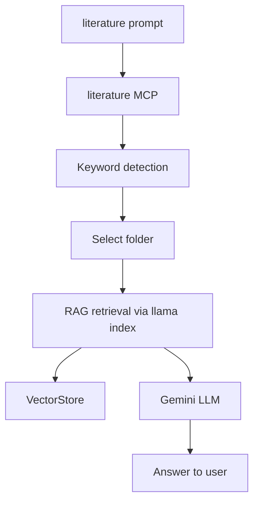
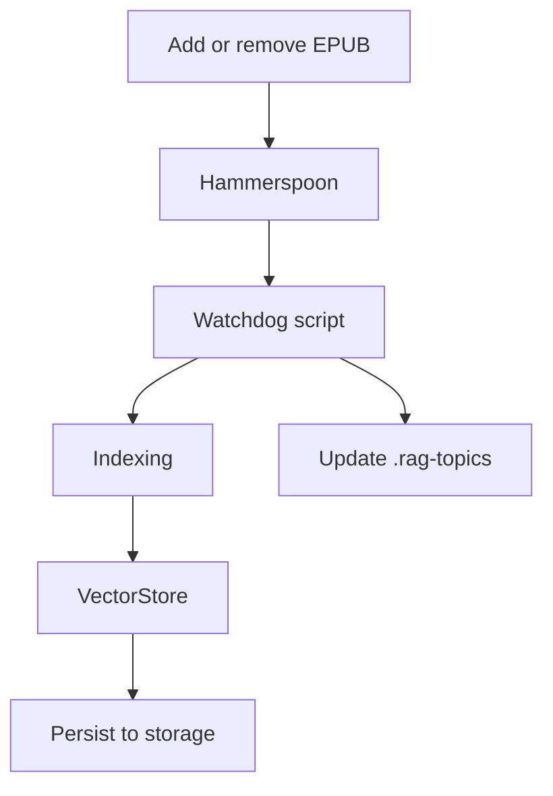

# Literature RAG

> Local retrieval-augmented generation for your book library

> Add or remove `.epub` books and let MCP automatically index book and update topic keywords, so you can ask questions to book or books

## What it does

1. **Indexes `.epub` books** in thematic folders under `books/`
2. **Extracts and updates keywords** for each folder using Gemini
3. **Allows fast queries** with citations, markdown links, sources and text snippets
4. **Integrates with VS Code (Copilot MCP)** for direct queries in the editor
5. **Tracks costs and usage** for book queries and embeddings prices (if any)

## Requirements

- VS Code: for editing and MCP integration
- Python 3.11+: recommended
- llama-index: RAG framework
- ebooklib: EPUB parsing
- beautifulsoup4: HTML parsing
- google-generativeai: Gemini API
- watchdog: file monitoring
- an LLM
- [Hammerspoon](https://www.hammerspoon.org/): configure the `literature_rag.lua` script to watch the `books/` folder for changes
- Gemini API key: kept in `.env`

## Usage

Always start with [`/literature`](./.github/prompts/literature.prompt.md) prompt so it turns MCP on and understands you want RAG context

## Adding or removing books

1. Place `.epub` files in a folder under `books/` (e.g., `books/urbanism/`)
2. Hammerspoon (macOS) detects changes and triggers auto-indexing
3. Keywords for each folder are updated automatically using Gemini
4. `.rag-topics` files are created/updated for keyword management

## Architecture

### 1. Querying (Ask a Question)

### 2. Updating RAG (Add/Remove Book)

## Security & Best Practices

- All API keys are kept in `.env` and never exposed in config files or code.
- Only the Gemini API key is required for embedding and LLM.
- All code and data live in `~/Documents/literature` for privacy and portability.

## TODO

### 🌀 UX Feedback Loop

- [ ] Discuss and design a better feedback loop for literature queries
- [ ] Reduce friction in user interactions and query approval
- [ ] Suggestion: MCP should only activate when `literature.prompt.md` is present, and always route literature questions through MCP for consistent, source-based answers
