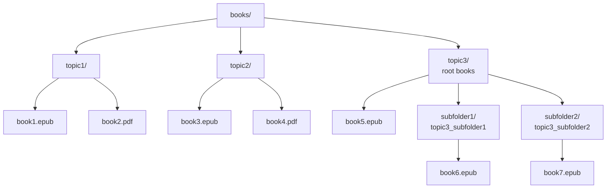
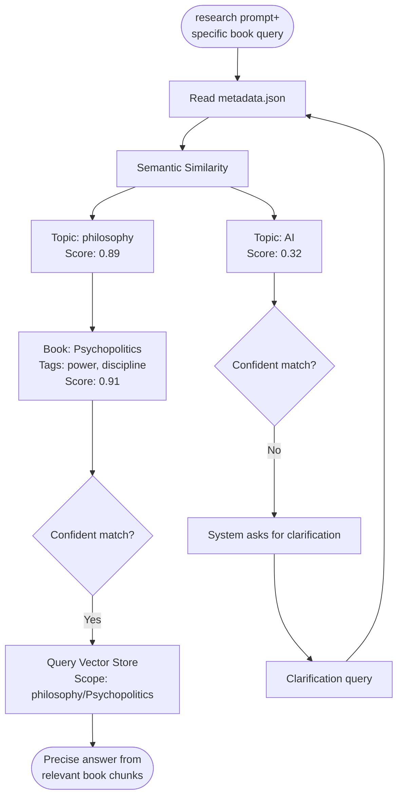

# Personal Library MCP

> A BYOB (Bring Your Own Books) local MCP so you can consult your library as you build your projects.

> All local (books, embedding models, database). [Connect with your favorite AI provider](#5-ai-provider-integration) and [ask away](#4-usage)

---

| Possible uses               | Description                                                                                                                                                     |
| :-------------------------- | :-------------------------------------------------------------------------------------------------------------------------------------------------------------- |
| ⚖️&nbsp;**Compliance**      | Collect all compliance and regulation manuals to test a new idea the proper way                                                                                 |
| 🔧&nbsp;**Home&nbsp;fixes** | Move all your home devices and appliances' instruction manuals + warranties, ask troubleshooting questions                                                      |
| 🌱&nbsp;**Gardening**       | Permaculture, indigenous plant guides, water management books to redesign your garden with less trial-and-error                                                 |
| 🎸&nbsp;**New&nbsp;hobby**  | Wanna try a new hobby but have no idea of scope? Collect authoritative books in the field you wanna learn, and reduce your confusion by asking freely questions |
| 🎮&nbsp;**Game&nbsp;Dev**   | Design patterns, procedural generation, narrative theory—query mid-project to find exactly which book explained that algorithm                                  |
| 🌍&nbsp;**Academic**        | Anthropology, ethnography, linguistics—entire library indexed locally, works offline for weeks in remote locations                                              |
| 💼&nbsp;**Professional**    | Legal texts, industry whitepapers, case studies—cite exact sources during audits or client presentations                                                        |
| 💪&nbsp;**Fitness**         | Training programs, nutrition guides, sports science—get grounded advice without influence rabbit holes                                                          |

---

> **📍 Current Status:** [v0.3 Delta Indexing](engine/docs/ROADMAP.md#epic-v03-delta-indexing--in-progress) 🔶 IN PROGRESS

> **Latest Release:** [v0.2.6 Partitioning Bug Fix](engine/docs/CHANGELOG.md#v026-partitioning-bug-fix--library-cleanup--jan-20-2026) ✅ (Jan 20, 2026)
>
> - Fixed partition_storage.py crash
> - 400x improved search quality (54,962 chunks vs 137)
> - [View full changelog](engine/docs/CHANGELOG.md)

> **(Probably) Next Release:** Delta indexing automation (update only changed books)
>
> - [View roadmap](engine/docs/ROADMAP.md) for planned features
>
> 👷 **Wanna collaborate?** Join [Personal Library signal group](https://signal.group/#CjQKIKD7zJjxP9sryI9vE5ATQZVqYsWGN_3yYURA5giGogh3EhAWfvK2Fw_kaFtt-MQ6Jlp8)

---

## Installation

1. **Clone this repo**
2. **[Install Python](https://www.python.org/downloads/)**: 3.11 or higher
3. **Run setup script**: `bash ./scripts/setup.sh`
   - Installs Python dependencies
   - Downloads local embedding model (all-MiniLM-L6-v2, ~90MB)
   - Model saved in `models/` directory (not tracked by git)
4. **BYOB**: Bring Your Own Books
   - Create folders in `books/` (one per topic)
   - Add `.epub` and `.pdf` files to each topic folder
   - Each folder becomes a searchable topic
   - **Optional:** Organize with subfolders for better grouping
     - Example: `books/cybersecurity/strategy/` → topic ID `cybersecurity_strategy`
     - Subfolders create separate topics with underscore naming
5. **Generate metadata**: `python3.11 scripts/generate_metadata.py`
   - Scans `books/` folders and creates `books/metadata.json`
6. **Build indices**: Choose one approach:
   - **Full index** (all topics): `python3.11 scripts/indexer.py`
   - **Per-topic** (recommended): `python3.11 scripts/reindex_topic.py <topic-id>`
   - Indices saved per-topic in `books/<topic>/faiss.index`
7. **Test (CLI)** - for debugging only:
   ```bash
   python3.11 scripts/research.py "what books discuss AI ethics?" --topic ai
   ```
   **Note:** Main usage is via [VS Code MCP integration](#5-ai-provider-integration), not CLI



---

## Usage

**Use `/research` prompt** to consult Personal Library MCP on your AI conversations (see [.github/prompts/research.prompt.md](.github/prompts/research.prompt.md))

Make sure to **specify topic or book** in your question. MCP will try to disambiguate based on metadata tags but the more focused the search, the better the results

**Example 1**: "`/research` what does Bogdanov say about Mars in Molecular Red?"

**Example 2**: "`/research` in my anthropocene books, what are the main critiques of geoengineering?"

**Example 3**: "`/research` what tarot spreads work best for decision-making under uncertainty?"

**Troubleshooting:** Books that failed to index (corrupted files, unsupported formats) go silently to `engine/docs/FAILED.md`

> 👉 Without `/research` your AI uses general knowledge. With it you get precise citations from your library

---

## How it works



---

<!-- ---

## AI Integration

The Personal Library MCP is **provider-agnostic**. Use your favorite AI provider:

| AI Provider        | Status                                                                                                                                                               |
| :----------------- | :------------------------------------------------------------------------------------------------------------------------------------------------------------------- |
| **Terminal**       | ✅ `python3.11 scripts/research.py "your question" --topic ai`                                                                                                       |
| **VS Code**        | ✅ `bash   code --install-extension https://github.com/nonlinear/personal-library/raw/main/.vscode/extensions/personal-library-mcp/personal-library-mcp-latest.vsix` |
| **Claude Desktop** | 👷 Pending                                                                                                                                                           |
| **OpenAI API**     | 👷 Pending                                                                                                                                                           |
| **LM Studio**      | 👷 Pending                                                                                                                                                           |
| **OpenWebUI**      | 👷 Pending                                                                                                                                                           |

> 👷 Wanna collaborate? Connect via [Personal Library signal group](https://signal.group/#CjQKIKD7zJjxP9sryI9vE5ATQZVqYsWGN_3yYURA5giGogh3EhAWfvK2Fw_kaFtt-MQ6Jlp8) -->

## Methodology

> **📋 Status Files Navigation**
>
> **Methodology files** (how we work):
>
> - 🤖 [CONTRIBUTING](.github/CONTRIBUTING.md) - Git workflow & branch strategy
> - 🤖 [whatsup.prompt.md](.github/prompts/whatsup.prompt.md) - Pre-commit workflow
>
> **Project status files** (what we're building):
>
> - 🤖 [ROADMAP](engine/docs/ROADMAP.md) - Planned features & in-progress work
> - 🤖 [CHANGELOG](engine/docs/CHANGELOG.md) - Version history & completed features
> - 🤖 [CHECKS](engine/docs/CHECKS.md) - Stability requirements & testing
>
> **File locations:**
>
> - Methodology: `.github/` (shareable across projects)
> - Project status: `engine/docs/` (project-specific)
