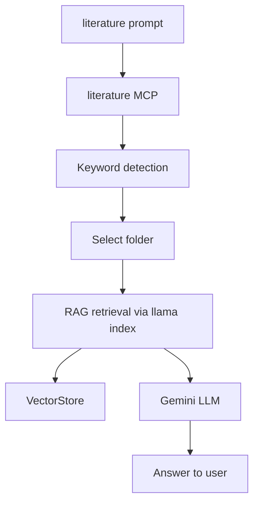
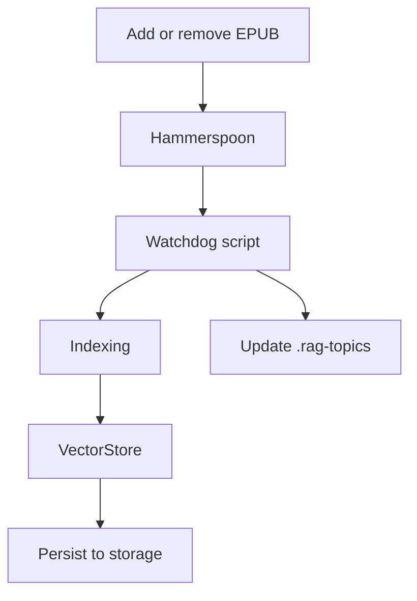

# Literature RAG

> Local retrieval-augmented generation for your book library

> 🚧 Under construction

## Asking a question

Always start with [`/literature`](./.github/prompts/literature.prompt.md) prompt so it turns MCP on and understands you want RAG context

```
/literature.prompt (specify either book or topic/folder),  question
```



## Adding, removing book

add, remove book under a folder/topic, then run [update literature](scripts/update_literature.py)



## Roadmap

## Roadmap (Updated: MCP ↔ Front End split)

1. Embed books via `update_literature.py` (MCP backend) ✅
2. Turn on Literature MCP (local service, Nix-managed) ✅
3. Query via literature prompt (client contract) ✅
4. Turn off MCP (service lifecycle, not editor tasks) ✅
5. Local embedding model (replace Gemini, MCP-only) ⏳
6. Better query UX (VS Code extension / terminal client) ⏳
7. Threading / multiprocessing + response cache (MCP) ⏳
8. Prompt asks for topic/book when ambiguous (front end) ⏳
9. Auto start/connect MCP from front end ⏳
10. PDF support (MCP ingestion) ⏳
11. Generalize config: paths, `.env`, new machines (MCP) ⏳
12. Image support (index + source attribution) ⏳

### Architecture Notes

- MCP = backend (local, Nix-managed, tool-agnostic)
- Front End = Last Mile (VS Code, terminal, others)
- VS Code extension is a thin client only
- No generic “bring-your-own MCP” VS Code extension yet

## 🤖 For AI

Always use `/opt/homebrew/bin/python3.11` (Homebrew's Python 3.11) to run scripts and install packages.
Never use venv or virtual environments; always install globally.

Install dependencies with:

```sh
/opt/homebrew/bin/python3.11 -m pip install <package>
```

Run scripts with:

```sh
/opt/homebrew/bin/python3.11 script.py
```

Never use `python3`, `python`, `pip`, or `pip3` without the full path.
Review this notice before running any script or installing dependencies.
Update this list with new findings as needed.

- All API keys are kept in `.env` and never exposed in config files or code.
- Only the Gemini API key is required for embedding and LLM.
- All code and data live in `~/Documents/literature` for privacy and portability.
