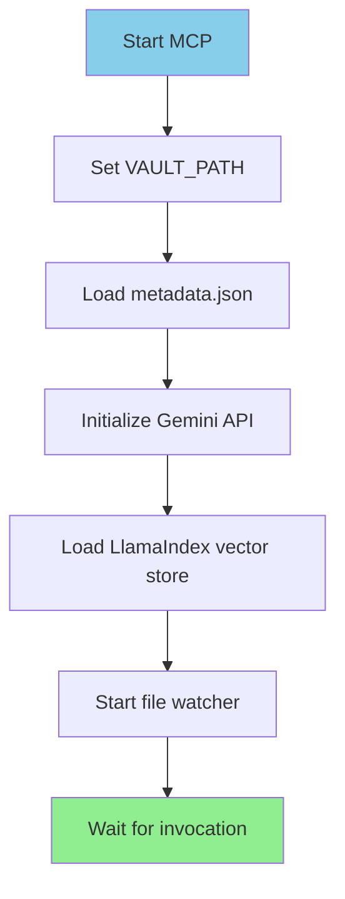
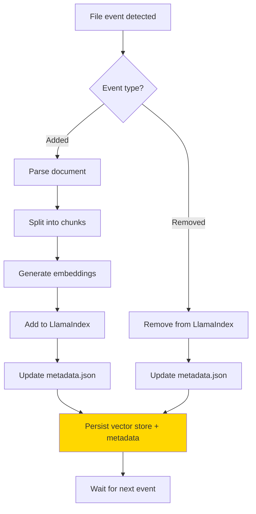
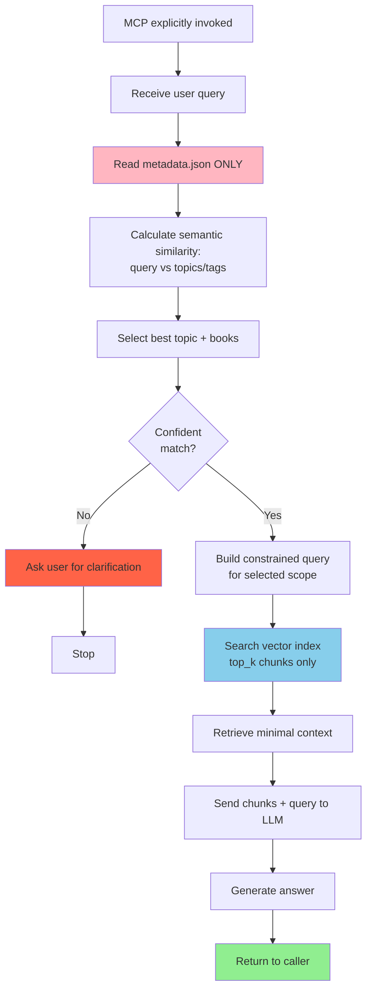
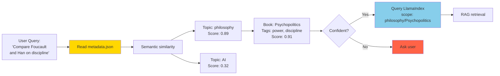

# Personal Library MCP

> A BYOB (Bring Your Own Books) local MCP so you can consult your library as you build your projects.

---

## Core Principles

**Every millisecond matters.**

This system is a **semantic orientation tool**, not a conversational assistant.

- **Map ≠ Territory**: Uses a single metadata file for navigation, not content replication
- **Explicit invocation only**: No automatic exploration or unsolicited responses
- **Delta indexing**: Only reindexes what changed
- **Client-agnostic backend**: VS Code is just one possible interface

---

## Architecture

### Vault Structure

```
books/
├── topic_a/
│   ├── book1.epub
│   └── book2.pdf
├── topic_b/
│   └── book3.epub
```

**Rules:**

- Exactly 1 folder level below `books/`
- Each folder = 1 topic
- Only EPUBs and PDFs inside

### Technology Stack

| Component     | Choice                 | Why                             |
| ------------- | ---------------------- | ------------------------------- |
| Engine        | Python 3.11            | Homebrew-managed, local control |
| RAG Framework | LlamaIndex             | Efficient indexing & retrieval  |
| Embeddings    | Gemini `embedding-001` | Fast API, 768-dim, free tier    |
| Vector Store  | LlamaIndex (native)    | No manual FAISS management      |
| File Watching | `watchdog`             | Delta detection                 |
| Metadata      | Single `metadata.json` | Fast navigation map             |

**Embedding Benchmark (M3 MacBook Pro):**

| Model                      | Startup | Query Latency | Quality   | Cost      |
| -------------------------- | ------- | ------------- | --------- | --------- |
| **Gemini embedding-001**✅ | <0.5s   | ~700ms        | Excellent | Free tier |
| all-MiniLM-L6-v2 (local)   | ~4s     | ~500ms        | Good      | $0        |

**Why Gemini?**

1. **Instant startup**: No 4s model loading
2. **Better embeddings**: 768-dim vs 384-dim
3. **Free tier**: Generous API limits
4. **Simpler**: LlamaIndex handles vector store

---

## The Map: `metadata.json`

**Purpose:** Minimal abstraction for rapid AI decision-making.

**Not:**

- A content copy
- A search index
- A documentation system

**Analogy:** Subway map, not geographic map.

### Structure

```json
{
  "topics": [
    {
      "id": "fitness",
      "label": "Fitness & Training",
      "description": "Physical training, strength, conditioning",
      "books": [
        {
          "id": "starting_strength",
          "title": "Starting Strength",
          "author": "Mark Rippetoe",
          "year": 2011,
          "tags": ["barbell", "strength", "programming"]
        }
      ]
    }
  ]
}
```

**Design decisions:**

- Tags exist only on books (semantic signal)
- Topics have: name + short description
- No text duplication
- Every field serves navigation

---

## System Pseudocode

### 1. MCP Initialization



**Rule:** MCP is passive. Nothing happens until explicitly called.

---

### 2. File Watching (Delta-Based)



**Rule:** Never reindex everything. Only delta changes.

---

### 3. Query Flow



---

### 4. Navigation Logic (Map ≠ Territory)



**Key insight:** The map guides navigation. Territory is only accessed after direction is clear.

---

## Query Flow Principles

**Steps:**

1. User asks a question
2. AI reads **only** `metadata.json`
3. AI calculates semantic similarity (query ↔ topics/tags)
4. AI selects best topic + books
5. **Only then** does vector store query execute
6. If unclear → request clarification

**Never:**

- Explore the vault without direction
- Load large contexts speculatively
- Attempt "smart" auto-discovery
- Make guesses when uncertain

---

## File Watching & Indexing

**Trigger:** Book added/removed from vault

**Process:**

1. `watchdog` detects filesystem change
2. Extract delta (new/removed files only)
3. Update embeddings (incremental)
4. Update `metadata.json`
5. Persist to LlamaIndex storage

**No full reindexing unless explicitly requested.**

---

## Quick Start

### Prerequisites

Before installation, you need:

**1. Python 3.11 or higher**

| Platform      | Installation                                                  |
| ------------- | ------------------------------------------------------------- |
| macOS         | `brew install python@3.11`                                    |
| Ubuntu/Debian | `sudo apt install python3.11`                                 |
| Windows       | [Download from python.org](https://www.python.org/downloads/) |

Verify: `python3.11 --version`

**2. Google Gemini API Key**

1. Get free API key: https://aistudio.google.com/app/apikey
2. Copy `.env-template` to `.env`:
   ```bash
   cp .env-template .env
   ```
3. Edit `.env` and add your key:
   ```bash
   GOOGLE_API_KEY=AIzaSy...your_actual_key_here
   ```

⚠️ **Never commit `.env` to git** (already in `.gitignore`)

**3. Run setup script**

```bash
./scripts/setup.sh
```

This installs all Python dependencies automatically.

**Manual setup (if needed):**

```bash
python3.11 -m pip install -r requirements.txt
```

---

### Usage

1. **Add your books**

   ```bash
   mkdir -p books/topic-name
   # Copy EPUB/PDF files to books/topic-name/
   ```

2. **Generate metadata**

   ```bash
   python3.11 scripts/generate_metadata.py
   ```

3. **Build index**

   ```bash
   python3.11 scripts/indexer.py
   ```

   Creates vector store in `storage/` (~92MB for 25 books)

4. **Query your library**

   ```bash
   python3.11 scripts/query.py "what books discuss AI ethics?"
   ```

---

## Dependencies

All installed via `requirements.txt`:

- `llama-index-core>=0.13.0` - RAG framework
- `llama-index-embeddings-google-genai>=0.1.0` - Gemini embeddings
- `llama-index-llms-gemini>=0.6.0` - Gemini LLM integration
- `llama-index-readers-file>=0.1.0` - EPUB/PDF parsing
- `keybert>=0.8.0` - Semantic tag extraction
- `ebooklib>=0.18` + `beautifulsoup4>=4.12.0` - EPUB parsing
- `python-dotenv>=1.0.0` - Environment variables
- `google-generativeai>=0.3.0` - Google AI SDK
- `watchdog>=3.0.0` - File system monitoring

---

## What This System Is Not

- ❌ Not a chat interface
- ❌ Not cloud-dependent
- ❌ Not a general-purpose MCP
- ❌ Not trying to be "smart" beyond navigation

**It is:**

- ✅ A navigation layer for your books
- ✅ A semantic index with minimal latency
- ✅ A local-first, privacy-preserving tool

---

## Development Notes

Required `.env` file for Gemini API:

```bash
# Copy template
cp .env-template .env

# Edit and add your key
nano .env
```

Contents:

```bash
GOOGLE_API_KEY=your_actual_key_here
---

## Roadmap

### Phase 1: Core Infrastructure ✅

- [x] Implement `metadata.json` generation
- [x] LlamaIndex vector store setup
- [x] Gemini embedding pipeline
- [x] CLI query tool (scripts/query.py)
- [ ] **NEXT:** File watcher with delta detection

### Phase 2: MCP Integration

- [x] MCP server with 3 tools (query_library, list_topics, list_books)
- [x] Metadata-first query routing
- [ ] **NEXT:** Test VS Code MCP integration end-to-end
- [ ] Clarification prompts when ambiguous
- [ ] Response caching

### Phase 3: Optimization

- [ ] **NEXT:** Measure MCP startup time (<0.5s target)
- [ ] Threading/multiprocessing for indexing
- [ ] Index persistence optimization
- [ ] PDF support (currently EPUB only)
- [ ] Image extraction and indexing

### Phase 4: Production

- [ ] Watchdog integration for auto-reindexing
- [ ] Terminal client (standalone)
- [ ] API documentation
- [ ] Performance benchmarks

---

## For AI Agents

When working on this codebase:

1. **Read `metadata.json` first** before any RAG query
2. **Never explore the vault** without explicit instruction
3. **Use Homebrew Python 3.11** for all operations
4. **Respect the map-territory distinction**
5. **Optimize for latency** over comprehensiveness
6. **Check roadmap on session start**: Read this README's Roadmap section and announce the next `- [ ] **NEXT:**` item as the suggested task

This is a navigation system, not a knowledge base.

---

## Project Status (Last Updated: 2026-01-15)

**Current State:**
- ✅ Phase 1 complete: Full LlamaIndex + Gemini migration
- ✅ 25 books indexed (3,547 chunks, 92MB storage)
- ✅ CLI query tool working (12s load + 389ms query)
- ⏳ MCP server ready but untested in VS Code

**Next Priority:**
- Test VS Code MCP integration (`/research` prompt)
- Measure actual MCP startup time
- Implement file watcher for delta indexing
```
