```mermaid
%%{init: {'theme':'base', 'themeVariables': { 'fontSize':'14px'}}}%%
graph LR
    subgraph "✅ Done"
        V1[v1.0.0<br/>Renaming<br/><small>Personal Library → Librarian</small>]
    end

    subgraph "🎯 Ready"
        V11[v1.1.0<br/>Hygiene]
        V12[v1.2.0<br/>User Testing]
    end

    subgraph "⏳ Blocked/Waiting"
        V14[v1.4.0<br/>Citation Expression<br/><small>VS Code limitation</small>]
        V13[v1.3.0<br/>Better Feedback]
    end

    subgraph "📅 Future"
        V15[v1.5.0<br/>FAILED→REPORT]
        V16[v1.6.0<br/>Error Handling]
        V17[v1.7.0<br/>Multi-User]
        V2[v2.0.0<br/>Admin Generalization<br/><small>Status files repo</small>]
    end

    V1 --> V11

    V1 --> V12
    V11 --> V13
    V12 --> V13
    V13 --> V14
    V14 --> V15
    V15 --> V16
    V16 --> V17
    V17 --> V2

    style V1 fill:#90EE90
    style V13 fill:#FFE4B5
    style V2 fill:#E6E6FA

```

# Librarian MCP

> A BYOB (Bring Your Own Books) local MCP so you can consult your library as you build your projects.

> All local (books, embedding models, database). Connect with your favorite AI provider and [ask away](#Usage)

---

| Possible uses               | Description                                                                                                                                                     |
| :-------------------------- | :-------------------------------------------------------------------------------------------------------------------------------------------------------------- |
| ⚖︠**Compliance**      | Collect all compliance and regulation manuals to test a new idea the proper way                                                                                 |
| 🔧**Home fixes** | Move all your home devices and appliances' instruction manuals + warranties, ask troubleshooting questions                                                      |
| 🌱**Gardening**       | Permaculture, indigenous plant guides, water management books to redesign your garden with less trial-and-error                                                 |
| 🸠**New hobby**  | Wanna try a new hobby but have no idea of scope? Collect authoritative books in the field you wanna learn, and reduce your confusion by asking freely questions |
| 🮠**Game Dev**   | Design patterns, procedural generation, narrative theory—query mid-project to find exactly which book explained that algorithm                                  |
| 🌠**Academic**        | Anthropology, ethnography, linguistics—entire library indexed locally, works offline for weeks in remote locations                                              |
| 💼**Professional**    | Legal texts, industry whitepapers, case studies—cite exact sources during audits or client presentations                                                        |
| 💪**Fitness**         | Training programs, nutrition guides, sports science—get grounded advice without influence rabbit holes                                                          |

---

## Installation

1. **Clone this repo**
2. **[Install Python](https://www.python.org/downloads/)**: 3.11 or higher
3. **Run setup**: `bash ./engine/scripts/setup.sh`
   - Installs dependencies
   - Downloads embedding model: [BAAI/bge-small-en-v1.5](https://huggingface.co/BAAI/bge-small-en-v1.5) (~130MB, 384-dim)
   - Saved in `engine/models/` (git-ignored)
4. **BYOB**: Bring Your Own Books
   - Create folders in `books/` (one per topic)
   - Add `.epub` and `.pdf` files
   - **Optional:** Use subfolders for grouping
     - Example: `books/cybersecurity/strategy/` → `cybersecurity_strategy`
5. **Generate metadata**: `python3.11 engine/scripts/generate_metadata.py`
6. **Build indices**:
   - Full: `python3.11 engine/scripts/indexer.py`
   - Per-topic: `python3.11 engine/scripts/reindex_topic.py <topic-id>`
7. **Test**: `python3.11 engine/scripts/research.py "AI ethics?" --topic ai`

---

## Usage

**Use `/research` prompt** to consult Librarian MCP on your AI conversations (see [.github/prompts/research.prompt.md](.github/prompts/research.prompt.md))

Make sure to **specify topic or book** in your question. MCP will try to disambiguate based on metadata tags but the more focused the search, the better the results

**Example 1**: "`/research` what does Bogdanov say about Mars in Molecular Red?"

**Example 2**: "`/research` in my anthropocene books, what are the main critiques of geoengineering?"

**Example 3**: "`/research` what tarot spreads work best for decision-making under uncertainty?"

**Troubleshooting:** Books that failed to index (corrupted files, unsupported formats) go silently to `MGMT/FAILED.md`

> 👉 Without `/research` your AI uses general knowledge. With it you get precise citations from your library

---

## How it works

---

## AI Integration

Librarian MCP is **provider-agnostic**. Use your favorite AI provider:

| AI Provider        | Status                                                                                                                                                        |
| :----------------- | :------------------------------------------------------------------------------------------------------------------------------------------------------------ |
| **Terminal**       | ✅ `python3.11 engine/scripts/research.py "your question" --topic ai`                                                                                         |
| **VS Code**        | ✅ `bash   code --install-extension https://github.com/nonlinear/librarian/raw/main/.vscode/extensions/personal-library-mcp/personal-library-mcp-latest.vsix` |
| **Claude Desktop** | 👷 Pending                                                                                                                                                    |
| **OpenAI API**     | 👷 Pending                                                                                                                                                    |
| **LM Studio**      | 👷 Pending                                                                                                                                                    |
| **OpenWebUI**      | 👷 Pending                                                                                                                                                    |

> 🤖
>
> - [README](./README.md) - Our project
> - [CHANGELOG](./MGMT/CHANGELOG.md) — What we did
> - [ROADMAP](./MGMT/ROADMAP.md) — What we wanna do
> - [POLICY](./MGMT/POLICY.md) [project](./MGMT/POLICY.md) / [global](./MGMT/global/POLICY.md) — How we do it
> - [CHECKS](./MGMT/CHECKS.md) — What we accept
> - [/MGMT-start](.github/prompts/MGMT-start.prompt.md) — Pre-commit validation
> - [/MGMT-end](.github/prompts/MGMT-end.prompt.md) — Session wrap-up
> - Wanna collaborate? Connect via [signal](https://signal.group/#CjQKIKD7zJjxP9sryI9vE5ATQZVqYsWGN_3yYURA5giGogh3EhAWfvK2Fw_kaFtt-MQ6Jlp8)
>
> 🤖

