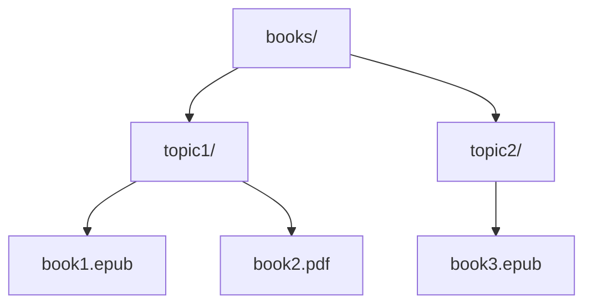

# Personal Library MCP

> A BYOB (Bring Your Own Books) local MCP so you can consult your library as you build your projects.

> All local (books, embedding models, database). [Connect with your favorite AI provider](#5-ai-provider-integration) and [ask away](#4-usage)

---

## Useful for:

| Use Case                | Description                                                                                                                                                     |
| ----------------------- | --------------------------------------------------------------------------------------------------------------------------------------------------------------- |
| ⚖️ **Compliance**       | Collect all compliance and regulation manuals to test a new idea the proper way                                                                                 |
| 🔧 **Home improvement** | Move all your home devices and appliances' instruction manuals + warranties, ask troubleshooting questions                                                      |
| 🌱 **Gardening**        | Permaculture, indigenous plant guides, water management books to redesign your garden with less trial-and-error                                                 |
| 🎸 **New hobby**        | Wanna try a new hobby but have no idea of scope? Collect authoritative books in the field you wanna learn, and reduce your confusion by asking freely questions |
| 🎮 **Game Dev**         | Design patterns, procedural generation, narrative theory—query mid-project to find exactly which book explained that algorithm                                  |
| 🌍 **Field Research**   | Anthropology, ethnography, linguistics—entire library indexed locally, works offline for weeks in remote locations                                              |
| 💼 **Professional**     | Legal texts, industry whitepapers, case studies—cite exact sources during audits or client presentations                                                        |
| 💪 **Fitness**          | Training programs, nutrition guides, sports science—get grounded advice without influence rabbit holes                                                          |

---

## How it works

---

## Installation

1. **Clone this repo**
2. **[Install Python](https://www.python.org/downloads/)**: 3.11 or higher
3. **Run setup script**: `bash ./scripts/setup.sh`
   - Installs Python dependencies
   - Downloads local embedding model (all-MiniLM-L6-v2, ~90MB)
   - Model saved in `models/` directory (not tracked by git)
4. **BYOB**: Bring Your Own Books
   - Exactly 1 folder level below `books/`
   - `.epub` and `.pdf`
   - Each folder is a topic
5. **Generate metadata**: `bash python3.11 scripts/generate_metadata.py`
6. **Build index** (includes auto-partitioning): `bash python3.11 scripts/indexer.py`
   - Creates vector store in `storage/`
   - Auto-partitions by topic for MCP lazy-loading
   - ~90MB for 34 books (local embeddings)
7. **Test**: `bash python3.11 scripts/query_partitioned.py "what books discuss AI ethics?" --topic ai`

---

## Usage

- **Use [/research prompt](https://github.com/nonlinear/personal-library/blob/main/.github/prompts/research.prompt.md)** to consult Personal Library MCP on your AI conversations
- Make sure to **specify topic or book** in your question. MCP will try to disambiguate based on metadata tags but the more focused the search, the better the results
- **Example 1**: "`/research` what does Bogdanov say about Mars in Molecular Red?"
- **Example 2**: "`/research` in my anthropocene books, what are the main critiques of geoengineering?"
- **Example 3**: "`/research` what tarot spreads work best for decision-making under uncertainty?"

> 👉 Without `/research` your AI uses general knowledge. With it you get precise citations from your library

---

## AI Integration

The Personal Library MCP is **provider-agnostic**. Use your favorite AI provider:

| AI Provider        | Status                                                                                                                                                                                                                |
| ------------------ | --------------------------------------------------------------------------------------------------------------------------------------------------------------------------------------------------------------------- |
| **Terminal**       | ✅ `python3.11 scripts/query_partitioned.py "your question" --topic ai`                                                                                                                                               |
| **VS Code**        | ✅ `code --install-extension personal-library-mcp-latest.vsix` (or [download .vsix](https://github.com/nonlinear/personal-library/raw/main/.vscode/extensions/personal-library-mcp/personal-library-mcp-latest.vsix)) |
| **Claude Desktop** | 👷 Pending                                                                                                                                                                                                            |
| **OpenAI API**     | 👷 Pending                                                                                                                                                                                                            |
| **LM Studio**      | 👷 Pending                                                                                                                                                                                                            |
| **OpenWebUI**      | 👷 Pending                                                                                                                                                                                                            |

> 👷 Wanna collaborate? Connect via [Personal Library signal group](https://signal.group/#CjQKIKD7zJjxP9sryI9vE5ATQZVqYsWGN_3yYURA5giGogh3EhAWfvK2Fw_kaFtt-MQ6Jlp8)

---

## Project Status

- **[Roadmap](roadmap.md)** - Planned features and in-progress work
- **[Release Notes](release-notes.md)** - Completed features and deployments

> 💡 **Want to add your idea?** Join [Personal Library signal group](https://signal.group/#CjQKIKD7zJjxP9sryI9vE5ATQZVqYsWGN_3yYURA5giGogh3EhAWfvK2Fw_kaFtt-MQ6Jlp8) and share your setup!
