```mermaid
%%{init: {'theme':'base', 'themeVariables': { 'fontSize':'14px'}}}%%
graph LR
    subgraph "🎯 Ready"
        V5B[v0.5.1<br/>Hygiene]
        V5C[v0.5.2<br/>User Testing]
    end

    subgraph "⏳ Blocked/Waiting"
        V7[v0.7.0<br/>Citation Expression<br/><small>VS Code limitation</small>]
        V6[v0.6.0<br/>Better Feedback]
    end

    subgraph "📅 Future"
        V8[v0.8.0<br/>FAILED→REPORT]
        V9[v0.9.0<br/>Error Handling]
        V10[v0.10.0<br/>Multi-User]
        ADMIN[v2.0.0<br/>Admin Generalization<br/><small>Status files repo</small>]
    end

    V5B --> V6
    V5C --> V6
    V6 --> V7
    V7 --> V8
    V8 --> V9
    V9 --> V10
    V10 --> ADMIN

    style V6 fill:#FFE4B5
    style ADMIN fill:#E6E6FA
```

# Librarian MCP - Changelog

> 🤖
>
> - [README](../../README.md) - Our project
> - [CHANGELOG](CHANGELOG.md) — What we did
> - [ROADMAP](ROADMAP.md) — What we wanna do
> - [CONTRIBUTING](CONTRIBUTING.md) — How we do it
> - [CHECKS](CHECKS.md) — What we accept
> - 👷 Wanna collaborate? Connect via [signal group](https://signal.group/#CjQKIKD7zJjxP9sryI9vE5ATQZVqYsWGN_3yYURA5giGogh3EhAWfvK2Fw_kaFtt-MQ6Jlp8)
>
> 🤖



```mermaid
%%{init: {'theme':'base', 'themeVariables': { 'fontSize':'14px'}}}%%
graph LR
    subgraph "✅ Done"
        V1[v1.0.0<br/>Renaming<br/><small>Personal Library → Librarian</small>]
    end

    subgraph "🎯 Ready"
        V11[v1.1.0<br/>Hygiene]
        V12[v1.2.0<br/>User Testing]
    end

    subgraph "⏳ Blocked/Waiting"
        V14[v1.4.0<br/>Citation Expression<br/><small>VS Code limitation</small>]
        V13[v1.3.0<br/>Better Feedback]
    end

    subgraph "📅 Future"
        V15[v1.5.0<br/>FAILED→REPORT]
        V16[v1.6.0<br/>Error Handling]
        V17[v1.7.0<br/>Multi-User]
        V2[v2.0.0<br/>Admin Generalization<br/><small>Status files repo</small>]
    end

    V1 --> V11
    V1 --> V12
    V11 --> V13
    V12 --> V13
    V13 --> V14
    V14 --> V15
    V15 --> V16
    V16 --> V17
    V17 --> V2

    style V1 fill:#90EE90
    style V13 fill:#FFE4B5
    style V2 fill:#E6E6FA
```

## v1.0.0

### 🎯 Renaming: Personal Library → Librarian

**Completed:** 2026-01-25

**BREAKING CHANGES:** Complete rebranding from "Personal Library" to "Librarian"

**Phase 1: Documentation & Code**

- Renamed all docs (README, CHANGELOG, ROADMAP, CHECKS, mcp-setup)
- Renamed all scripts (mcp_server.py, indexer_v2.py, watch_library.py)
- Updated MCP server identifier: personal-library → librarian

**Phase 2: Infrastructure**

- Renamed local folder: personal library → librarian
- Updated library_path in library-index.json

**Phase 3: GitHub Repository**

- Renamed GitHub repo: personal-library → librarian
- Updated all documentation links
- Updated remote URLs

**Migration:** Update MCP config to use "librarian" instead of "personal-library"

---

---

## v0.5.0

### ✅ Smart Indexing | [notes](gaps/epic-notes/v0.5.0.md)

**Completed:** 2026-01-25

Architecture-first modular indexing with delta detection and target metadata for future navigation.

**What we built:**

**Phase 1: Modular Architecture**

- [x] Migrated from monolithic `metadata.json` to per-topic `topic-index.json`
- [x] Each topic folder is self-contained (metadata + faiss.index + chunks.json)
- [x] Main `library-index.json` v2.0 registry (topic list + config)
- [x] All scripts migrated to library-index.json v2.0
- [x] MCP server auto-discovers topics from filesystem
- [x] Schema version tracking per topic

**Phase 2: Target Metadata (Page/Chapter)**

- [x] chunks.json v2.0 schema (added `page`, `chapter`, `cfi` fields)
- [x] PDF chunking: extracts page numbers during indexing
- [x] EPUB chunking: extracts chapter/section during indexing
- [x] Metadata stored in chunks.json
- [x] Backward compatibility maintained (old chunks still work)
- [x] Validation: chunks have expected metadata

**Phase 3: Smart Detection (Topic-Level Delta)**

- [x] Topic-level change detection (hash folder contents)
- [x] Compare filesystem state vs stored hash in topic-index.json
- [x] Only reindex changed topics (nuke + rebuild per topic only)
- [x] Added `--force` flag to reindex everything
- [x] Massive time savings (unchanged topics skipped)

**Phase 4: User-Visible Output**

- [x] Show page/chapter in research.py output (text format, not links)
- [x] Format: "Book.pdf (page 42)" or "Book.epub (chapter 3)"
- [x] No pills/links (VS Code limitation deferred to v0.7.0)

**Bonus Features:**

- [x] Added `--book` filter to research.py (narrow queries to specific book)
- [x] Unified indexing scripts into indexer_v2.py (deprecated 3 legacy scripts)
- [x] Fixed EPUB chunking bug (SentenceSplitter)
- [x] Documented VS Code file picker limitation (size-based autocomplete filtering)

**Benefits:**

- ✅ Topic folders are portable (same embedding model = just copy folder)
- ✅ Corruption sandboxed (bad topic ≠ dead library)
- ✅ Faster operations (small JSON files, parallel indexing possible)
- ✅ Git-friendly (changes per topic, not monolithic)
- ✅ 23× faster reindexing (delta detection)
- ✅ Correct chunking (200+ chunks per book vs 1)

**Migration:**

Run migration script to convert v1 metadata to v2:

```bash
python3.11 scripts/migrate_to_v2.py
```

Backup created automatically at `books/library-index.json.v1.backup`

**Impact:**

Users with large libraries (50+ topics) see massive speedups. Reindexing only changed books instead of entire library.

---

## v0.4.0

### ✅ Epic Workflow Infrastructure | [notes](gaps/epic-notes/v0.4.0.md)

[commit](https://github.com/nonlinear/librarian/commit/467e8f6)

**Completed:** 2026-01-25

Epic-based development workflow and VS Code citation limitations discovery.

**What we built:**

- [x] Epic workflow documentation (8-step process in CONTRIBUTING.md)
- [x] Branch naming convention: `v0.X.0` (version only)
- [x] Epic notes location: `engine/docs/gaps/epic-notes/v0.X.0.md`
- [x] Two-tier checks policy (soft-fail branches, hard-fail main)
- [x] Gaps workflow for session documentation
- [x] ADHD-friendly workflow improvements
- [x] wrap-it-up.prompt.md for pausing sessions
- [x] Branch detection in whatsup.prompt.md (light workflow for epic branches)

**Critical Discovery:**

🔴 **VS Code pill validation breaks with URL fragments** (`#page=42`, `#chapter3`)

- Tested 6 different anchor syntaxes - all failed
- Any `#` in URL prevents pill from rendering
- Blocker for clickable page/chapter navigation
- Documented in epic notes with test methodology

**Impact:**

Source Granularity features (page/chapter anchors) blocked by VS Code limitation.
Deferred to v0.7.0 for workarounds and alternatives.

**Migration:** None (workflow improvements)

---

## v0.3.1

### Epic-per-branch workflow

[commit](https://github.com/nonlinear/librarian/commit/999717af9c9932299e690580c5bba5b3c201e47b)

Branch-based development for each roadmap epic.

- [x] Enforce: Each ROADMAP epic = dedicated feature branch
- [x] Branch naming: `v{major}.{minor}-{epic-name}` (e.g., `v0.3-delta-indexing`)
- [x] Workflow: Regular rebase from `main` to stay current
- [x] Completion criteria: Merge to `main` = move ROADMAP section → CHANGELOG
- [x] Add git hooks or CI checks to validate workflow compliance
- [x] Update whatsup.prompt.md to handle feature branch workflow
- [x] Document branch-based development in contributing guide
- **Note:** Current workflow is direct commits to `main` (works for now)

---

## v0.3.0

### Meta-Workflow Infrastructure

[commit](https://github.com/nonlinear/librarian/commit/a5b5d23a6621da8fd51647c0b6135e2caf6d7fa7)

Established workflow infrastructure for epic-based development

✅ Always copy navigation block from README to status files
🗒️ Originally planned as "Delta Indexing" but pivoted to meta-workflow. Delta automation deferred.

---

## v0.2.6

### Library cleanup

[commit](https://github.com/nonlinear/librarian/commit/8c8c8fa1853e8e26b02ec5938b2d7b8709410687)

fixing subtopics as flat ones

- Root cause: Variable used before assignment in loop
- Impact: Full reindexing (indexer.py) would fail at partitioning step
- Now works: `topic_label = topic_info[topic_id]['label']` added before use

**Library Maintenance:**

**Files changed:**

**🔧 Migration:** None - just a bug fix

---

## v0.2.5

### Path Resolution & Platform-Agnostic Prompt

[commit](https://github.com/nonlinear/librarian/commit/bc656194dd3da44fc84212481d82c0d75a26cd9e)

**👥 Who needs to know:** Users with subtopics (AI/theory) or folder names with spaces (product architecture)

**📦 What's new:**

**Path Resolution Fix:**

- Solves ambiguity: `ai_theory` → `"AI/theory"` vs `product_architecture` → `"product architecture"`
- No more guessing from topic IDs with underscores
- `research.py` - FAISS index loading
- `reindex_topic.py` - Topic folder location
- `mcp_server.py` - MCP query routing
- `partition_storage.py` - Storage partitioning

**Prompt Improvements:**

- Removed MCP-specific tool calls
- Generic command execution: `python3.11 scripts/research.py "{query}" --topic {topic}`
- Works with any AI provider: VS Code (run_in_terminal), Claude Desktop (MCP/shell), OpenAI (subprocess), Terminal (manual)

**Files changed:**

**🔧 Migration:**

1. **Regenerate metadata:** `python3.11 scripts/generate_metadata.py` (adds folder_path to all topics)
2. No reindexing needed - existing indices work fine

**Example fixes:**

---

## v0.2.4

### Critical Chunking Bug Fix

[commit](https://github.com/nonlinear/librarian/commit/7008ee14412eb840a25e2d90bd7e0ad3b3aa17a0)

**👥 Who needs to know:** ALL USERS - this fix improves search quality 400x

**📦 What's new:**

**Critical Bug Fixed:**

- **Before:** 137 chunks from 197 books (0.7 chunks/book) = unusable search
- **After:** 54,962 chunks from 282 books (195 chunks/book avg) = proper granular search
- **Impact:** Nearly 2x the health target (100+ chunks/book)
- Search can now find specific passages instead of entire books

**Root cause:** `partition_storage.py` was iterating through docstore (original documents) instead of the chunked nodes created during indexing

**Files changed:**

**🔧 Migration:**

1. **Reindex required:** Run `python3.11 scripts/indexer.py` to rebuild all indices with proper chunking
2. Takes 5-10 minutes for full library (worth it for 400x improvement!)

**Example improvements:**

**Discovered during:** NAS books reorganization + chunking diagnostics

---

## v0.2.3

### Critical Bug Fixes

[commit](https://github.com/nonlinear/librarian/commit/005f7544c06b9f06ca59809edea6f4334bc3405e)

**👥 Who needs to know:**

**📦 What's new:**

**Problems Fixed:**

1. **Path Resolution Bug:** Topics with underscores failed to resolve correctly
   - Nested topics: `cybersecurity_applied` didn't map to `books/cybersecurity/applied/`
   - Root topics with spaces: `product_architecture` didn't map to `books/product architecture/`
   - **Impact:** Books weren't being indexed, queries failed silently

2. **Critical Chunking Bug:** EPUB books weren't chunked properly
   - `reindex_topic.py` used raw documents instead of chunked nodes from index
   - **Result:** 1 chunk per book instead of ~200 chunks per book
   - **Example:** `product_architecture` had only 5 chunks from 5 books (should be ~1000+)
   - **Impact:** Severely degraded search quality - couldn't find specific passages

**Solutions Implemented:**

- Try nested path first (`topic_id.replace('_', '/')`)
- Fall back to label if nested path doesn't exist
- Handles both nested topics and root topics with underscores
- Changed from iterating raw documents to extracting chunked nodes from index
- Added explicit chunk settings (1024 chars, 200 overlap)
- Added debug output showing chunk counts
- `query_partitioned.py` → `research.py` (matches research.prompt.md)
- `mcp_server_lazy.py` → `mcp_server.py` (production server)
- Added happy path validation test to CHECKS.md
- Added CHANGELOG append-only policy to whatsup.prompt.md
- Designed comprehensive REPORT.md system in ROADMAP

**🔧 Migration:**

```bash
python3.11 scripts/indexer.py
```

```bash
python3.11 scripts/reindex_topic.py <topic-name>
```

**Impact:** Correct indexing for all topic types, dramatically improved search quality

---

## v0.2.2

### Failed Books Tracking

[commit](https://github.com/nonlinear/librarian/commit/3b8ebc82f3cfa3a8f91a18e6c8c8578cd4d46db8)

**👥 Who needs to know:**

**📦 What's new:**

**Problem:** Books that fail to index (corrupted files, unsupported formats) errors were only shown during indexing with no persistent log

**Solution Implemented:** Failed Books Log

**Impact:** Easy troubleshooting for corrupted/unsupported books

**🔧 Migration:** None (automatic on next index run)

---

## v0.2.1

### Infrastructure Improvements

[commit](https://github.com/nonlinear/librarian/commit/242b33733cc31b0a03e786e6f1ecda4c671038c7)

**👥 Who needs to know:**

**📦 What's new:**

**Problem:** Fragmented documentation, outdated tests, missing AI conventions

**Solution Implemented:** Workflow Consolidation 🧹

**Impact:** Cleaner repo, accurate tests, better AI collaboration

**🔧 Migration:** None (documentation/tooling only)

---

## v0.2.0

### PDF Support + Integrated Reindexing

[commit](https://github.com/nonlinear/librarian/commit/517420bf9b22bcb7d2b26186cd0ab251eb120e2)

**👥 Who needs to know:**

**📦 What's new:**

**Problem:** Only EPUBs supported, reindexing loaded model 23 times (memory inefficient)

**Solution Implemented:** PDF Support + Single-Process Reindexing 🎉

- [x] PyMuPDF (fitz) for text extraction
- [x] Updated `generate_metadata.py` for PDF metadata extraction
- [x] Updated `reindex_topic.py` with file type detection (.epub vs .pdf)
- [x] Updated `mcp_server_lazy.py` to handle PDF documents
- [x] Tested with 4 PDFs in computer vision topic (2460 chunks indexed)
- ⚠️ MuPDF ICC profile warnings (cosmetic, don't affect indexing)
- [x] Created `scripts/reindex_all.py`
- [x] Loads embedding model **once**, reuses for all 23 topics
- [x] 23× more memory efficient than subprocess approach
- [x] Prevents Python crashes from repeated model loading
- [x] Tested `all-mpnet-base-v2` (768-dim) for better quality
- [x] Crashes on M3 Mac during reindexing (leaked semaphores)
- [x] Decided to keep `all-MiniLM-L6-v2` (384-dim) for stability

**Impact:** Mixed EPUB/PDF libraries now supported, 23× more efficient reindexing

**🔧 Migration:** None (backward compatible)

---

## v0.1.0

### Database Optimization

[commit](https://github.com/nonlinear/librarian/commit/418d98ef7a95fb0552b2486954f71367a9a2aab)

**👥 Who needs to know:**

**📦 What's new:**

**Problem:** `storage/docstore.json` (17MB) caused 30s MCP startup delay + Gemini API dependency

**Solution Implemented:** Topic-Based Lazy Loading + Local Embeddings 🎉

- [x] Replaced Gemini (768-dim) → sentence-transformers (384-dim)
- [x] Model stored in `models/` (90MB, gitignored)
- [x] Zero API keys required - fully offline
- [x] Updated: `indexer.py`, `research.py`, `setup.sh`
- [x] Removed: `.env` requirement, API key docs
- [x] Loads ONLY `metadata.json` (19KB) on startup → **instant** (<100ms)
- [x] Lazy-loads topics on first query (~2s per topic)
- [x] Topic caching prevents reload

**🔧 Migration:** Run `python3.11 scripts/indexer.py` to regenerate partitioned storage

**Impact:** Mixed EPUB/PDF libraries now supported, 23× more efficient reindexing

---

## v0.0.0

### Initial Release

**Core infrastructure for Librarian MCP**

- [x] Model cached in `models/` (90MB, not tracked by git)
- [x] Zero API keys required
- [x] Fully offline operation

**Impact:** Full local MCP infrastructure for book queries

---

> 🤖
>
> - [README](../../README.md) - Our project
> - [CHANGELOG](CHANGELOG.md) — What we did
> - [ROADMAP](ROADMAP.md) — What we wanna do
> - [CONTRIBUTING](CONTRIBUTING.md) — How we do it
> - [CHECKS](CHECKS.md) — What we accept
> - 👷 Wanna collaborate? Connect via [signal group](https://signal.group/#CjQKIKD7zJjxP9sryI9vE5ATQZVqYsWGN_3yYURA5giGogh3EhAWfvK2Fw_kaFtt-MQ6Jlp8)
>
> 🤖


