# Personal Library MCP - Roadmap

```mermaid
%%{init: {'theme':'base', 'themeVariables': { 'fontSize':'14px'}}}%%
graph LR
    subgraph "🚧 In Progress"
        V5A[v0.5.0<br/>Smart Indexing<br/><small>🚧 active</small>]
    end

    subgraph "🎯 Ready"
        V5B[v0.5.1<br/>Hygiene]
        V5C[v0.5.2<br/>User Testing]
    end

    subgraph "⏳ Blocked/Waiting"
        V7[v0.7.0<br/>Citation Expression<br/><small>VS Code limitation</small>]
        V6[v0.6.0<br/>Better Feedback]
    end

    subgraph "📅 Future"
        V8[v0.8.0<br/>FAILED→REPORT]
        V9[v0.9.0<br/>Error Handling]
        V10[v0.10.0<br/>Multi-User]
        ADMIN[v1.0.0<br/>Admin Generalization<br/><small>Status files repo</small>]
    end

    V5A --> V7
    V5A -.data ready.-> V7
    V5B --> V6
    V5C --> V6
    V6 --> V7
    V7 --> V8
    V8 --> V9
    V9 --> V10
    V10 --> ADMIN

    style V5A fill:#FFD700
    style V6 fill:#FFE4B5
    style ADMIN fill:#E6E6FA
```

> 🤖 **AI: Update this mermaid graph when grooming roadmap**
>
> - Move epics between subgraphs as status changes
> - Add new nodes for new epics
> - Update dependencies (arrows) when priorities shift
> - Keep it visual - this is the "subway map" of the project

---

## v0.5.0

### [🚧](https://github.com/nonlinear/personal-library/tree/v0.5.0) Smart Indexing | [notes](gaps/epic-notes/v0.5.0.md)

🚧 Smarter indexing (delta detection) + deeper metadata (page/chapter).

**Goal:** Only reindex what changed + capture page/chapter for future navigation.

**What we're building:**

**Phase 1: Architecture (Modularize First)**

- [ ] Modularize metadata: Move from single `metadata.json` to per-topic `.metadata.json`
- [ ] Each topic folder becomes self-contained (metadata + faiss.index + chunks.json)
- [ ] Main metadata.json becomes registry (just topic list + config)
- [ ] Update all scripts to use per-topic metadata
- [ ] Ensure MCP server can auto-discover topics from filesystem
- [ ] Schema version tracking per topic (for compatibility)

**Phase 2: Target Metadata (Page/Chapter)**

- [ ] Update chunks.json schema to v2.0 (add `page`, `chapter`, `cfi` fields)
- [ ] PDF chunking: Extract page numbers during indexing
- [ ] EPUB chunking: Extract chapter/section during indexing
- [ ] Store metadata in chunks.json
- [ ] Handle backward compatibility (old chunks without page/chapter)
- [ ] Add validation: chunks have expected metadata

**Phase 3: Smart Detection (Topic-Level Delta)**

- [ ] Detect topic-level changes (hash folder contents)
- [ ] Compare filesystem state vs stored hash in .metadata.json
- [ ] Only reindex changed topics (nuke + rebuild per topic)
- [ ] Add `--force` flag to reindex everything
- [ ] Massive time savings (unchanged topics skipped)

**Phase 4: User-Visible Output**

- [ ] Show page/chapter in research.py output (as text, not links)
- [ ] Format: "Book.pdf (page 42)" or "Book.epub (chapter 3)"
- [ ] No pills/links yet (VS Code limitation)

**Benefits of modular architecture:**

- ✅ Topic folders are portable (same embedding model = just copy folder)
- ✅ Corruption sandboxed (bad topic ≠ dead library)
- ✅ Faster operations (small JSON files, parallel indexing possible)
- ✅ Git-friendly (changes per topic, not monolithic)

**Why merge delta + granularity:** Same code area (indexer), one schema upgrade, users get both improvements at once.

**Phased approach:** Architecture first (modularize), then detection (delta), then display (page/chapter).

🗒️ Deferred clickable navigation to v0.7.0 (Citation Expression - VS Code limitation)
🗒️ Book ID system discussion → See v0.11.0 Future Ideas (deduplication, stable references)

**Branch:** `v0.5.0`

## v0.5.1

## v0.5.1

### Hygiene

Repository structure and code hygiene improvements for long-term maintainability. Includes "Tuck In: Hidden Object Files" epic.

- [ ] Move all folders except books/ into engine/
- [ ] Update all scripts, tests, and documentation to use new paths
- [ ] Ensure all stability checks and workflows pass after refactor
- [ ] Document migration steps and any breaking changes
- [ ] Update all scripts and wiring to use hidden filenames (e.g., `.faiss.index`, `.chunks.json`, `.chunks.pkl`)
- [ ] Ensure all read/write operations support hidden files
- [ ] Document migration and update instructions
- [ ] Test for compatibility across OSes
- [ ] Add stability check for hidden object files
      🗒️ Previous attempts failed due to path/test breakage—requires careful, coordinated update.

## v0.5.0

## v0.5.2

### User testing

Test repo from the start, change docs or setup to comply.

- [ ] End-to-end repo setup validation
- [ ] Update documentation for onboarding
- [ ] Add setup scripts/checks for new users
- [ ] Collect feedback from first-time users

## v0.6.0

### Better feedback loop

Improve feedback and interaction for users and contributors (includes VS Code Extension Configuration and Direct mentions).

- [ ] Rethink what an extension can do and if we even need it
- [ ] Discuss possibility of extension
- [ ] Examples to copy
- [ ] Autocomplete for topics and books
- [ ] Folder/subfolder awareness
- [ ] Integration with /research prompt
- [ ] Support direct book queries
- [ ] Extension configuration

## v0.7.0

### Source Granularity (Deferred from v0.4.0)

⏳ Add page/chapter references to citations (VS Code pill limitation workaround).

**Problem:** VS Code pill validation breaks with URL fragments, blocking clickable navigation.

**Alternative approaches:**

- [ ] Two-link format: `[Book.pdf](path) - See page 42`
- [ ] Text-only granularity: `[Book.pdf](path) (page 42)`
- [ ] File VS Code issue requesting fragment support
- [ ] Research custom extension for citation handling
- [ ] Extract page numbers during PDF chunking
- [ ] Extract chapters during EPUB chunking
- [ ] Update chunks.json schema to v2.0 (add page/chapter fields)
- [ ] Modify research.py output format
- [ ] Testing & validation

🗒️ Requires VS Code team response or custom extension development

## v0.8.0

### FAILED to REPORT

Visibility into indexing health and automatic detection of problems

- [ ] Track timing metrics (total time, time per book, chunks per second)
- [ ] Generate `engine/docs/REPORT.md` after each indexing run
- [ ] **✅ Success section:** Topics indexed successfully with stats
- [ ] **⚠️ Alert section:** Suspicious chunking (health check failures)
- [ ] **❌ Error section:** Books that failed to index
- [ ] Calculate expected chunks from filesize (EPUB: ~1 chunk/1KB, PDF: ~1 chunk/1.5KB)
- [ ] Flag topics with suspiciously low chunk counts
- [ ] Add `--validate` flag to `reindex_topic.py`
- [ ] Track chunks/MB ratio per topic
- [ ] Store metrics in metadata.json
      **Current issue:** Only ~0.7 chunks/book (137 chunks from 197 books). Expected: 100+ chunks/book.

## v0.9.0

### Granular Error Handling

Implement granular error reporting for MCP research pipeline

- [ ] Python not installed or wrong version
- [ ] research.py missing or not executable
- [ ] metadata.json missing or corrupted
- [ ] faiss.index missing or corrupted
- [ ] Model not downloaded
- [ ] MCP internal exception (traceback)
- [ ] Timeout (query takes too long / max time exceeded)
- [ ] Disk full or IO error
- [ ] On "success but empty" (no results for topic/book), clearly inform user and suggest similar concepts or related topics/books as follow-up
- [ ] Document all error types and user-facing messages

## v0.10.0

### Multi-User Support

Add support for multi-user environments (permissions, access control)

- [ ] Permission/access error handling

## v1.0.0

### Admin Generalization

⏳ Extract workflow infrastructure to reusable admin toolkit for all projects.

**Goal:** Status files and workflow prompts become a separate repo/package that ANY project can use.

**Problem:** Current workflow (whatsup, wrap-it-up, ROADMAP, CHANGELOG, CHECKS) is project-specific but the pattern is universal.

**Solution:**

**Status Files Architecture:**

- [ ] Create new repo: `nonlinear/admin-toolkit` or similar
- [ ] Separate global files (templates) from project files (instances)
  - **Global (toolkit repo):**
    - ROADMAP.template.md (with mermaid instructions)
    - CHANGELOG.template.md (format spec)
    - CHECKS.template.md (test framework)
    - CONTRIBUTING.template.md (workflow rules)
  - **Project (this repo):**
    - ROADMAP.md (this project's epics)
    - CHANGELOG.md (this project's history)
    - CHECKS.md (this project's tests)
    - CONTRIBUTING.md (this project's conventions + global rules)

**Command Generalization:**

- [ ] Rename prompts to admin commands:
  - `/whatsup` → `admin start` (check status, choose work)
  - `/wrap-it-up` → `admin stop` (pause session, document progress)
  - `/research` → stays project-specific
- [ ] Commands live in toolkit repo
- [ ] Projects import/reference admin toolkit

**Update Propagation:**

- [ ] When toolkit updates global rules, all projects get improvements
- [ ] Projects can override with local rules (inheritance pattern)
- [ ] Template updates don't break project-specific content

**Implementation:**

- [ ] Design architecture: git submodule vs npm package vs simple clone
- [ ] Create toolkit repo structure
- [ ] Extract global prompts (admin start, admin stop)
- [ ] Extract global templates (status files)
- [ ] Document how projects adopt toolkit
- [ ] Migrate personal-library to use toolkit
- [ ] Test with 2+ different project types
- [ ] Version toolkit (semver for breaking changes)

**Command Syntax:**

- [ ] Implement "global: do this" command routing to .github/ infrastructure
- [ ] Implement "project: do that" command routing to project-specific code
- [ ] AI automatically determines scope and routes to proper instruction files
- [ ] Example: "global: update roadmap" → edits .github/prompts/, "project: reindex" → runs scripts/
- [ ] Add command parser to distinguish global vs project intent
- [ ] Document command syntax in CONTRIBUTING.md

**Benefits:**

- ✅ Any project gets instant workflow infrastructure
- ✅ Improvements propagate to all projects
- ✅ Project-specific rules stay isolated
- ✅ Reduces duplication across projects
- ✅ Clear separation: admin commands vs domain commands

🗒️ This IS the meta-workflow becoming a product

## v0.11.0

### Future Ideas

Enhancements for later versions

**Book Identity & Deduplication (Discussion Needed):**

- [ ] **DISCUSS:** Do we need stable book IDs across renames?
  - Current: filename = ID (rename = new book)
  - Alternative: Hash-based ID (survives renames)
  - Use case: Track "same book" across moves/renames
- [ ] **DISCUSS:** Deduplication strategy
  - Same book in multiple topics (reference vs copy?)
  - Same content, different files (hash matching?)
  - User intent: duplicate on purpose vs accidental?
- [ ] **DISCUSS:** Cross-references between books
  - "This book references that book"
  - Requires stable IDs or filename tracking?
- [ ] Document trade-offs: simplicity vs features

**Local Embedding Models:**

- [x] Sentence Transformers (`all-MiniLM-L6-v2`) ✅ ACTIVE
  - Pros: Free, fast, offline, 384-dim
  - Model cached in `models/` (90MB)
  - Stable, no crashes
- [x] Tested `all-mpnet-base-v2` (Jan 18, 2026) ❌ ABANDONED
  - Pros: Better semantic quality (768-dim)
  - Cons: Crashes during reindexing on M3 Mac, 2x slower
  - Decision: Reverted to MiniLM for stability
- [ ] Test BGE embeddings (e.g., `BAAI/bge-small-en-v1.5`)
  - Pros: Better quality, still local, 384-dim
  - Cons: Larger model size
- [ ] Make embedding model swappable (config-based)
      **Meta Development Workflow:**
  - **Note:** Current workflow is direct commits to `main` (works for now)
    **Other Enhancements:**

- [ ] **Clean up folder structure**
  - [ ] Reorganize into 2 top-level folders: `books/` and one for everything else
  - [ ] Update all scripts to handle new structure
  - [ ] Test indexer, metadata generation, MCP server
  - [ ] Update documentation with new structure
  - [ ] Requires careful testing - breaking change
- [ ] PDF support (currently EPUB only)
- [ ] Image extraction and indexing from books
- [ ] Response caching for repeated queries
- [ ] Clarification prompts when query is ambiguous
- [ ] Threading/multiprocessing for faster indexing
- [ ] Terminal client (standalone, non-MCP)
- [ ] API documentation
- [ ] Performance benchmarks documentation
  - [ ] Research EPUB/PDF viewers with URI scheme support
  - [ ] Provider-specific citation formats (VS Code pills, terminal hyperlinks, etc.)
  - [ ] Format: `viewer://file=path&search=query`
  - [ ] One-click navigation from citations to exact location in book
  - [ ] Integration with MCP response format
    > 🤖
    >
    > - [README](./README.md) - Our project
    > - [CHANGELOG](./engine/docs/CHANGELOG.md) — What we did
    > - [ROADMAP](./engine/docs/ROADMAP.md) — What we wanna do
    > - [CONTRIBUTING](./engine/docs/CONTRIBUTING.md) — How we do it
    > - [CHECKS](./engine/docs/CHECKS.md) — What we accept
    > - [/whatsup](./.github/prompts/whatsup.prompt.md) — The prompt that keeps us sane
    >
    > 🤖
